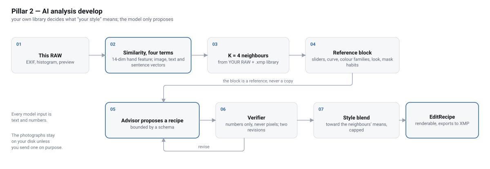
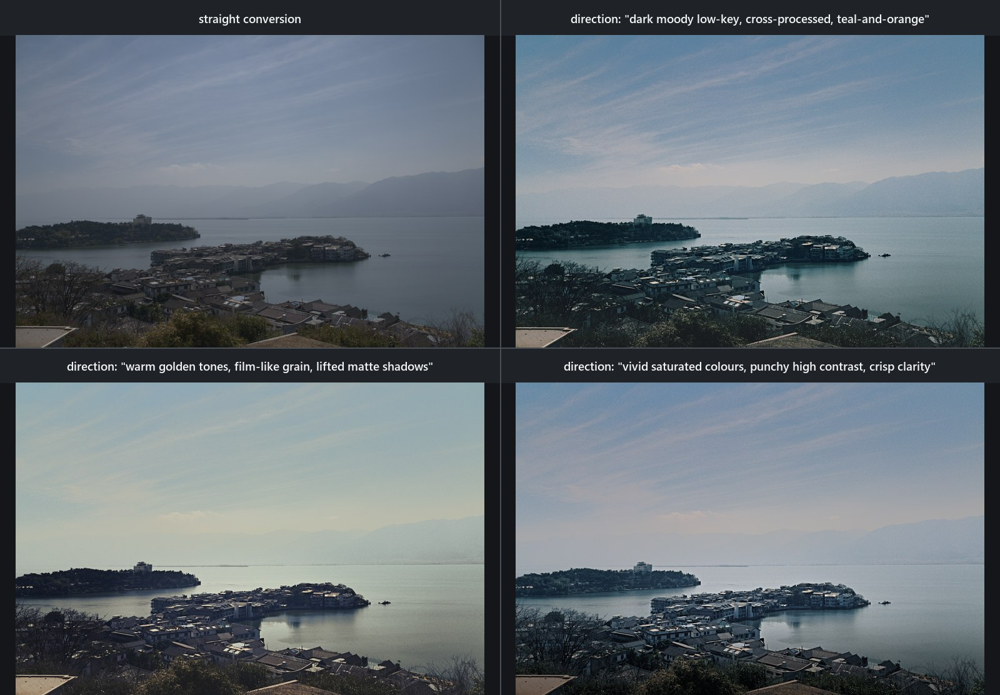
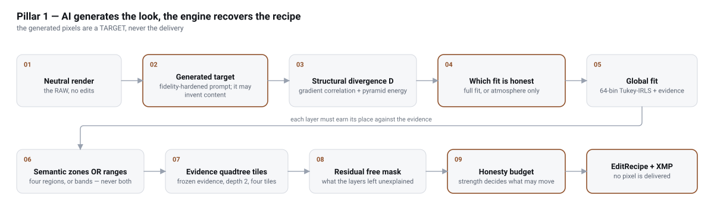
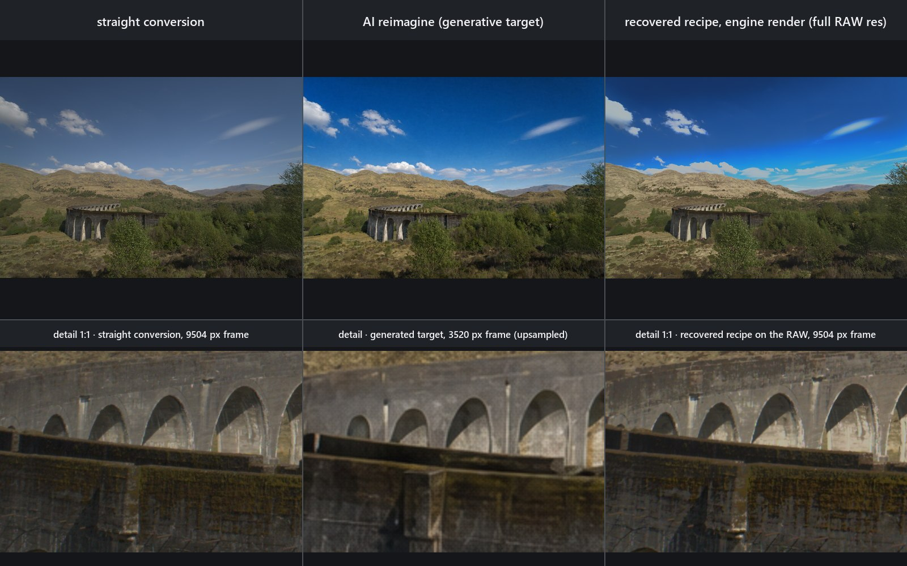
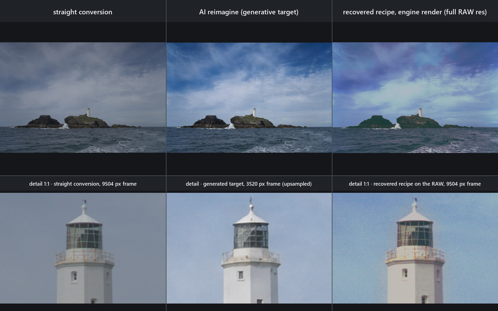
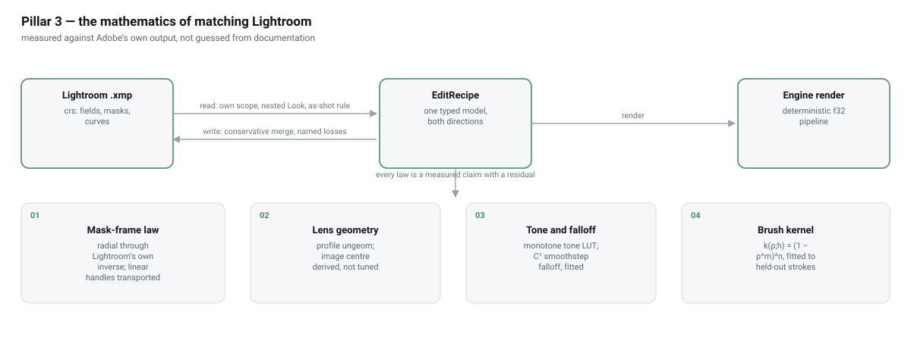
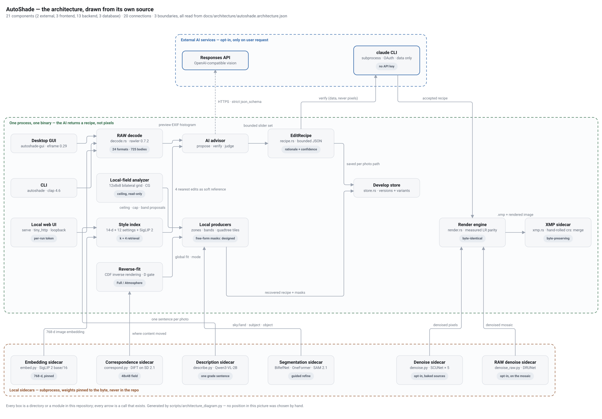

<div align="center">


# AutoShade

**AI-assisted automatic development of RAW photographs.**

An AI decides *what to change*. A deterministic Rust engine *does* it.
**In the recipe-development path, the AI never touches a pixel.**

[Download v1.2.4](https://github.com/skymanbp/autoshade/releases/tag/v1.2.4) ·
[Architecture](docs/ARCHITECTURE.md) ·
[Release ledger](docs/ROADMAP.md) ·
[MIT](LICENSE)

</div>

---

## What AutoShade is

- A non-destructive developer for RAW and baked images: an AI proposal becomes
  a small, inspectable `EditRecipe` — bounded controls, a rationale, a
  confidence — rendered by one local Rust engine behind the app, the CLI and
  the web UI.
- The recipe is hand-editable, replayable a year later, and can be handed to
  Lightroom; generative tools are separate, opt-in, labelled paths.
- For anyone who wants an AI first pass on a card of RAWs and still wants to
  know *what* it changed, in numbers, before trusting it.

## Contents

- [What AutoShade is](#what-autoshade-is)
- [What it does](#what-it-does)
- [What is new here](#what-is-new-here)
- [How it works](#how-it-works)
- [Measured numbers](#measured-numbers)
- [Install and quickstart](#install-and-quickstart)
- [User manual](#user-manual)
- [Supported formats](#supported-formats)
- [Tech stack, algorithms, and design philosophy](#tech-stack-algorithms-and-design-philosophy)
- [Status, roadmap, and known limitations](#status-roadmap-and-known-limitations)
- [License and acknowledgements](#license-and-acknowledgements)

## What it does

- **AI develop** — `analyze`, `auto` and **Analyze** propose an editable
  recipe from preview, EXIF and histogram, check it data-only, render it, and
  may buy one bounded revision.
- **A deterministic develop engine** — tone, white balance, curves, HSL,
  colour grading, texture, clarity, dehaze, NR, sharpening, vignette, crop and
  lens correction, under linear, radial, brush, bitmap, luminance-range and
  colour-range masks composed by Add/Subtract/Intersect.
- **Local AI masks** — subject (BiRefNet, named U²-Net fallback), sky
  (OneFormer ADE20K) and point-prompted object (SAM 2.1), as local Python
  sidecars with pinned weights; no API key.
- **Lightroom/ACR interoperability** — sidecar XMP is the merge base, written
  back with unmodeled fields preserved byte for byte; beside-RAW export is a
  separate confirmed action.
- **Style read** — your past Lightroom edits, and a separate library of
  finished looks, retrieved as soft references through opt-in local SigLIP 2
  embeddings.
- **Reverse-fit** — `match` estimates an engine recipe from any target look,
  measures how far its *content* diverged before trusting it, then fits
  global, semantic, luminance-range and colour-range corrections behind
  evidence gates.
- **Generative and pixel tools, opt-in and labelled** — reimagine
  (gpt-image-2), retouch, heal and SCUNet denoise are the only paths that can
  invent or alter scene content, and are marked so.
- **Versions, variants and three front ends** — Original, AI-generated and
  Reverse-fit cards with numbered snapshots in a per-user develop store shared
  by all three.

Out of scope in this release: bit-exact Adobe rendering (parity is measured),
an exact X-Trans demosaic (the plane fit is approximate) and a notarised macOS
build (a decision, not a gap — the bundle stays ad-hoc signed, so the first
launch needs one explicit 「Open Anyway」 per machine).

## What is new here

The techniques below are the ones you will not find in another RAW developer.
Each ends at the document that carries the rest; the last subsection lists
what is designed but not yet shipped.

### 1. Style reference is retrieval over your whole catalogue, not a preset

<picture>
  <source media="(prefers-color-scheme: dark)" srcset="docs/images/pillar-analysis-dark.svg" />
  
</picture>

<sub>Zoom and pan this diagram at [autoshade.dev/#pillar-analysis](https://autoshade.dev/#pillar-analysis).</sub>



<sub><b>One photograph, four looks.</b> The straight conversion of a hazy
lakeside frame and three AI develops of the same RAW at the same
<code>--style 1.0 --strength 0.9</code> against the photographer's full
index — 169 Lightroom RAW+XMP edits and a 94-photo finished-look library —
where only the <b>direction text</b> changes. Since v1.2.3 a written
direction leads and those edits become background: mean saturation
28 % / 11 % / 30 % for moody / golden / vivid against the
conversion's 17 %, mean brightness 43 % / 58 % / 70 % against
47 %. The vivid develop's recipe crops — its cell is 9504×5702, 7 % off
the top and 3 % off the bottom — while moody, golden and the conversion are
the full 9504×6336 frame. On v1.2.2 the same three directions on the same index came back
at 23 % / 11 % / 17 % saturation and 54 % / 58 % / 55 % brightness — inside those
edits' cool, hazy register, four points of brightness apart. Judge trails,
prompts and the finished-look-only run in [docs/SHOWCASE.md](docs/SHOWCASE.md);
model-judge scores are automated review, not human aesthetic approval.</sub>

`autoshade style-index <dir>` turns every Lightroom RAW+XMP pair you finished
into an exemplar ([`src/style.rs`](src/style.rs)); a photo retrieves its **4
most similar past shots** as a soft reference.

- An exemplar carries a 14-dimensional EXIF/histogram feature, the 12 develop
  settings you moved, your curve shape, colour families and a local-work habit
  — summary statistics only.
- Optional local models add a 768-dimensional **SigLIP 2** image vector and,
  with `--describe`, one **Qwen3-VL-2B** sentence about the *grade*; nothing
  leaves the machine.
- Retrieval is
  `d14 + W_EMB·(1−cos(q_img,e_img)) + W_TXT·(1−cos(q_txt,e_img)) + W_DESC·(1−cos(q_txt,e_desc))`,
  shipped at `W_EMB = 4`, `W_TXT = 0.5`, `W_DESC = 0.5` — the calibration
  harness's winners on the real corpus, hubness removed before the z-score.
- `W_LOOK = 1.0` is the unmeasured term: the look library carries no develop
  settings for that objective to see, so it ships inside a stable band.
- `style_pull` (0.18 at the shipped Style 0.3, full at Style 1.0) moves the
  proposal toward your historical means, unless a Direction at Adherence above
  40 % leads; a `--looks` library guides the proposer but never becomes a
  recipe target.

Details: [docs/TECH_STACK.md#ai-advisor-and-reverse-fit](docs/TECH_STACK.md#ai-advisor-and-reverse-fit).

### 2. Reverse-fit: inverse rendering from any finished look

<picture>
  <source media="(prefers-color-scheme: dark)" srcset="docs/images/pillar-reimagine-fit-dark.svg" />
  
</picture>

<sub>Zoom and pan this diagram at [autoshade.dev/#pillar-reimagine-fit](https://autoshade.dev/#pillar-reimagine-fit).</sub>



<sub><b>Stone viaduct.</b> Top row: the straight conversion, a 3520×2352
<code>gpt-image-2</code> target asked for <i>a clearer afternoon, a little more
contrast, a slightly deeper blue sky, everything else unchanged</i>
(<b>D = 0.180</b>, under the 0.35 threshold, so the full solve ran),
and the recovered recipe rendered on the 9504×6336 RAW, fitted at panel
Strength 100 % (the product default is 65 %): look error
<b>0.161 → 0.023</b> at confidence 0.63 through a global solve whose cast
curves were projected to t = 0.485, a four-band colour mixer at the 45
ceiling, two semantic zones, two boundary-gated tiles and one field mask.
Bottom row: the same window of the frame at each source's native
resolution — the recipe carries the look, the RAW carries the detail, and
the generated frame carries neither at full size. At the default 65 % the
same pair fits to 0.047 at confidence 0.25 with the mixer capped at 18, and
v1.2.2's fit of it is where the seam fix was measured, on the top-left sky
tile: cross-boundary step 0.0278 → 0.0042, the delivered seam +3.15 → +0.92
codes on the mask-free ruler.</sub>



<sub><b>Cornwall lighthouse islet.</b> The same three stages on a frame shot
with the body set to a 4:3 aspect, which is how it found the two frame defects
v1.2.2 fixes: sized from the sensor frame the same prompt bought a target at
<b>D = 0.136</b> (0.304 when the request was sized from the cropped
preview), and the fit ran on a neutral develop of the full frame with the
calibration composed into the solve — look error <b>0.137 → 0.027</b> at
confidence 0.66, two semantic zones, four boundary-gated tiles and two field masks. This is the frame
that found v1.2.3's cast defect: the v1.2.2 fit admitted three channel curves that
passed every hue veto and still fanned the sky 33.1° across luminance
(violet at the top, green-cyan in the bright cloud). A fourth veto now reads that fan,
and the curves are shrunk toward one shared shape (t = 0.363) until it clears —
the delivered sky spread is 9.6° against the target's 1.6°. Full measurements
and prompts in [docs/SHOWCASE.md](docs/SHOWCASE.md).</sub>

`match` recovers an editable recipe from any finished rendition of the same
frame ([`src/fit.rs`](src/fit.rs)). A generated target is not pixel-aligned
with its source, so the solve is **distribution-level, not per-pixel
regression**:

- Luminance CDFs are matched at the engine's own tone knots and least-squares
  solved against its own slider basis under a ridge and a model-selection
  prior; saturation closes by mean-chroma ratio.
- The per-channel CDF residual becomes RGB curves admitted only through four
  vetoes and a projection: one refuses a cast painting a hue more than 45°
  from every target family over ≥ 5 % of the frame, and the fourth (v1.2.3)
  refuses curves that fan a single-hued class by ≥ 15° across luminance.
- Residual tone-curve knots sit uniformly in the LUT's *output* domain, which
  keeps a steep camera base curve from sagging the chords by ~10/255.

Details: [docs/TECH_STACK.md#ai-advisor-and-reverse-fit](docs/TECH_STACK.md#ai-advisor-and-reverse-fit).

### 3. A structural-divergence statistic decides how much to believe a target

A structural reading `D` — gradient correlation and a five-band pyramid energy
error — measures whether the target still shows the same scene.

- Same scene → the Full solve above. Repainted scene (`D ≥ 0.35`) → bounded
  **Atmosphere** mode: EV ±1, WB gain [0.80, 1.25], saturation ±30, curve
  slope [0.5, 1.5], confidence capped at 0.50, no per-channel curves, and a
  *structure-blind* ruler that stops asking replaced content to survive.
- Strength governs that budget: the shipped 0.65 path is byte-identical to the
  calibrated path, WB included; above it an out-of-budget WB is shrunk along
  its fitted log-K/linear-tint manifold and must clear the foreign-hue veto
  and a rotation budget opening from 0.05 at default through 0.593 at 0.85 to
  1.0 at full strength, or it is withheld.

Details: [docs/TECH_STACK.md#reverse-fit-freedom-budget](docs/TECH_STACK.md#reverse-fit-freedom-budget).

### 4. Diffusion features find where the content moved

On divergent pairs the fit consults a **DIFT correspondence field** — Stable
Diffusion 2.1's UNet as a featurizer (`t = 261`, 768² inputs, `up_blocks[1]`
features, an 8-draw ensemble run one at a time to bound VRAM) — whose 48×48
grid weights a Full zone's pixel pairs and reads shifted content where it
moved.

- Confidence is cyclic consistency × local flow smoothness, with raw cosine
  kept out of it, so a pixel-shuffle of the same frame stays honestly
  unmatchable.
- An identity pair reads median confidence 1.000 at 100 % coverage against
  0.009 (21.5 %) for the calibration pair's generated sky; identity and
  zero-confidence fields change nothing, by test.

Details: [docs/TECH_STACK.md#ai-advisor-and-reverse-fit](docs/TECH_STACK.md#ai-advisor-and-reverse-fit).

### 5. Semantic zones, luminance bands and colour bands, judged on their own population

- Local corrections come from mutually exclusive producers: a local OneFormer
  ADE20K pass yields semantic bitmap regions (sky/land by default, up to four
  disjoint class regions opt-in), and with segmentation off or unavailable a
  pure-Rust pass derives **XMP-native luminance-range bands** from rank-paired
  residuals under an evidence gate, then **colour-range bands** from the eight
  ACR hue bands — one mask keyed to each band's own mean colour, read on both
  frames, and refused unless the band has evidence on both sides of the edit.
- Every verdict follows the population a correction moves: a land zone is not
  withheld because a replaced sky shares its luminance bins, and a zone whose
  luminance already matches says so instead of being dialled for a hairline
  gain.

Details: [docs/TECH_STACK.md#zone-scoped-evidence-view](docs/TECH_STACK.md#zone-scoped-evidence-view).

### 6. Quadtree tile splitting on frozen evidence

After the zones or bands, a frozen-evidence quadtree visits the strongest
supported nodes first and stops at a 4×4 grid.

- A tile is kept only when both frames contribute ≥ 3 % evidence, original
  structure stays comparable, its confidence interval excludes zero, its
  boundary stays within the calibrated rim ceiling (0.012, charged per
  crossing against the scene's own step since v1.2.2), and the composed frame
  does not regress.
- Tiles are ordinary editable bitmap masks: recipe JSON keeps them losslessly
  and classic XMP omits each with a named bitmap-mask loss.
- A **free-form remainder pass** ranks 4-connected, sign-pure components of
  the residual no tile covers, at most two, through the same gates; every
  proposal on the calibration corpus was refused, so it contributes
  disclosure, not corrections.

Details: [docs/TECH_STACK.md#layered-spatial-reverse-fit-and-mask-refinement](docs/TECH_STACK.md#layered-spatial-reverse-fit-and-mask-refinement).

### 7. A bilateral-grid local field prices every local producer first

Before any local producer runs, a read-only **12×8×8 bilateral grid** (x, y,
luma) of five develop parameters is solved by conjugate gradients in f64 — λ =
1 Tikhonov toward the global fit, a Laplacian smoother, ≤ 90 iterations,
weights = frozen evidence × structural support × unclipped.

- Its rendered residual is the **ceiling**: how much of the remaining
  difference *any* spatially varying develop could reach; the calibration
  pair's reading is under [Measured numbers](#measured-numbers), and the Rust
  solve agrees with the NumPy reference to 1.5 × 10⁻⁵ across 768 vertices.
- The field never touches a pixel: it proposes luminance bands to the range
  producer, refused when the sign disagrees, halves the tile budget when the
  remainder is not tile-shaped, and ends the fit early within 0.002 of a
  ceiling that beat the producer-free frame.

Details: [docs/TECH_STACK.md#local-field-analyzer](docs/TECH_STACK.md#local-field-analyzer).

### 8. Edge-aware mask refinement that has to earn its keep

- Semantic silhouettes and eligible tile boundaries go through guided
  refinement (radius 8) before their corrections are fitted — and the original
  mask bytes win unless coverage is conserved, every pixel outside the fixed
  collar is unchanged, guide-edge alignment does not fall, and the rim and
  frame gates still pass.
- The AI masks themselves run locally, weights pinned to the byte and every
  alpha cached under a provenance key, so a better backend forces an honest
  re-derivation rather than serving an older mask as the new model's.

Details: [docs/TECH_STACK.md#layered-spatial-reverse-fit-and-mask-refinement](docs/TECH_STACK.md#layered-spatial-reverse-fit-and-mask-refinement).

### 9. Lightroom parity is measured, and the residuals are published

<picture>
  <source media="(prefers-color-scheme: dark)" srcset="docs/images/pillar-lightroom-math-dark.svg" />
  
</picture>

<sub>Zoom and pan this diagram at [autoshade.dev/#pillar-lightroom-math](https://autoshade.dev/#pillar-lightroom-math).</sub>

The tone LUT, the two-arm Texture model (`A1 = 0.172443`, `A2 = 0.304888`;
45 of 45 Lightroom anchors within ±0.02), the 290×11 radial feather LUT,
the brush law `(1 − ρ^m)^n` with the measured flow constant `κ = 0.1284`
(D1 error 874 px → 9.8 px), and the lens mask-frame transport built from
Sony's own 16 native samples (radial 41/41 vectors within 1 px; linear
openly *not* pixel-closed, RMS 9.748/7.025/6.336 px) were each fitted to
Lightroom output. The XMP layer is hand-rolled on purpose — no XML crate —
so a catalogue sidecar is merged into byte for byte — down to the SVD fold
between Lightroom's pixel-space radial tilt and the engine's normalised
rotation, and down to its `tiff:Orientation`, rewritten only when the
photographer's own turn has moved away from it — and Lightroom's Brotli-packed
brush dab streams are imported and verified (`MD5 → .acr → Brotli`). Two of
those fits were re-measured in
v1.2.4 against Lightroom's own coverage rather than exported luma, on a
46-export pack: the LINEAR falloff moved onto the abscissa `t^1.124`
(α rms 0.0293 → 0.0074), and the radial boundary was shown to be a pure
0.99876 scale of the stored ellipse — no dilation law.

### 10. Generated pixels are quarantined and measured

- `reimagine` composes the prompt onto an unconditional faithfulness scaffold
  (because `input_fidelity` is silently dropped by gpt-image-2), measures the
  result's structural divergence with the same `D` the reverse-fit uses, warns
  at `D ≥ 0.35`, and can spend one bounded retry keeping the closer image.
- `heal` only ever copies, shifts and averages pixels that already exist, and
  anything that changed pixels lives on its own card as a pixel source — never
  disguised as a Lightroom adjustment.

Details: [docs/TECH_STACK.md#ai-advisor-and-reverse-fit](docs/TECH_STACK.md#ai-advisor-and-reverse-fit).

### Designed, not yet shipped

Nothing. Everything that used to sit here has shipped: the style-retrieval
expansion (finished exports as a look library, the SigLIP 2 text tower, local
Qwen3-VL descriptions, the GUI embedding switch and the Direction-adherence
axis) landed across steps 14 and S1–S3; the eased linear-gradient falloff — the
C1 Hermite smoothstep, RMS 0.0045 against 0.017 for a straight ramp on its
first measurement — shipped in v1.2.0, and v1.2.4 moved its abscissa onto
`t^1.124` against Lightroom's own 46 exports (α rms 0.0064; 0.0315 for the
plain smoothstep, 0.0598 for a straight ramp); and v1.2.4 closed the last two
entries: the colour-range producer (the reverse-fit's second range family:
one mask keyed to each ACR hue band's own mean colour, written as the
colour range mask Lightroom itself writes) and a Linux x64 command-line archive built and
published from the tag beside the Windows and macOS assets.

## How it works

<picture>
  <source media="(prefers-color-scheme: dark)" srcset="docs/images/architecture-dark.svg" />
  
</picture>

<sub>Twenty components, nineteen connections and three boundaries, generated from
[autoshade.architecture.json](docs/architecture/autoshade.architecture.json) by
[scripts/architecture_diagram.py](scripts/architecture_diagram.py): no position
in the picture is chosen by hand, and the shared checker in
[scripts/diagram_check.py](scripts/diagram_check.py) refuses to write the file
when any two labels, borders or arrows touch. Zoom and pan it at
[autoshade.dev/architecture.html](https://autoshade.dev/architecture.html).</sub>

- [`src/decode.rs`](src/decode.rs) decodes the RAW into a preview, EXIF and a
  histogram; the advisor in [`src/advisor/`](src/advisor/) turns those into an
  `EditRecipe` ([`src/recipe.rs`](src/recipe.rs)), and a verifier that
  receives recipe, EXIF, histogram and clipping data — never pixels — checks
  it.
- [`src/render.rs`](src/render.rs) applies it; the image, the recipe and a
  Lightroom-readable sidecar ([`src/xmp.rs`](src/xmp.rs)) go to the per-user
  develop store, and local masks, style retrieval, reverse-fit and the
  generative tools hang off that path unchanged.
- `EditRecipe` is the **only** channel between the AI and the pixels: strict
  `json_schema`, every control bounded and clamped on entry, missing fields
  defaulted so older recipes stay readable, one struct behind GUI, CLI, web UI
  and the XMP projection.
- The renderer is a deterministic f32 pipeline, so the same recipe on the same
  RAW yields the same bytes every run; and the XMP writer edits only the
  fields it owns, so a Lightroom catalogue survives a round trip.

Details: [docs/ARCHITECTURE.md](docs/ARCHITECTURE.md).

## Measured numbers

Every figure is reproduced from the section that owns it; none is an estimate.
Sources are the pinned claims in [docs/TECH_STACK.md](docs/TECH_STACK.md) and
the tests [`scripts/check_docs.py`](scripts/check_docs.py) re-derives.

| What | Measured | Where |
|---|---|---|
| Automated test battery | 1395 library / 24 CLI / 164 GUI / 2+2 contract tests; `check_docs` re-derives the pinned release claims | [Tech stack](#tech-stack-algorithms-and-design-philosophy) |
| RAW coverage | 24 extensions, 725 camera bodies; nine-camera format zoo 9/9 at the last release gate | [Supported formats](#supported-formats) |
| Lightroom Texture parity | 45 of 45 period/depth anchors within ±0.02 | [Develop pipeline](#develop-pipeline-and-tone-model) |
| Radial mask closure | 41 of 41 measured vectors within ≤1 px | [Lens correction](#lens-correction-and-lightroom-mask-frame-laws) |
| Linear mask closure (openly not pixel-closed) | RMS 9.748 / 7.025 / 6.336 px with lens correction on, 12.449 / 9.943 / 4.979 px off | [Lens correction](#lens-correction-and-lightroom-mask-frame-laws) |
| Linear falloff vs Lightroom coverage (46-export pack) | smoothstep on `t^1.124`: α rms 0.0064 against 0.0315 for the plain smoothstep and 0.0598 for a straight ramp; half-coverage contour +34.2/+38.2 px → +0.9/+5.0 px | [Lens correction](#lens-correction-and-lightroom-mask-frame-laws) |
| Radial boundary (46-export pack) | a pure 0.99876 scale of the stored ellipse (sd 4×10⁻⁵ over masks 0.30/0.50/0.70 of frame): −1.12/−1.96/−2.79 px, no dilation law | [Lens correction](#lens-correction-and-lightroom-mask-frame-laws) |
| Roundness (tilted 2:1 ellipse, feather 25/50/75) | Lightroom's R−100/0/+100 exports differ by max\|Δ\| = 0 DN over 26 Mpx; the engine draws one ellipse too | [Masks](#masks) |
| Brush geometry | D1 error 874 px → 9.8 px after pixel-centre sampling and the pixel/aspect metric | [Masks](#masks) |
| X-Trans demosaic (approximate) | X-S10 G/R ratio 1.5503 → 0.9476 | [RAW decode](#raw-decode-and-cfa) |
| Reverse-fit, stone viaduct (full solve, panel Strength 100 %) | look error 0.161 → 0.023 at confidence 0.63 (a global solve with the cast curves projected to t = 0.485, the per-band mixer on Orange/Yellow/Aqua/Blue at the 45 ceiling, two semantic zones, two boundary-gated tiles and one field mask), D = 0.180; at the default 65 % the pair fits to 0.047 at confidence 0.25 with the mixer capped at 18, four tiles and two field masks, and v1.2.2's fit of it is where the seam fix was measured: sky tile 0.0278 → 0.0042 (k 0.121), delivered +3.15 → +0.92 codes | [What is new §2](#2-reverse-fit-inverse-rendering-from-any-finished-look) |
| Reverse-fit, Cornwall islet (full solve, composed calibration) | look error 0.137 → 0.027 at confidence 0.66, D = 0.136 sized from the sensor frame (0.304 from the cropped preview); the global cast projected to t = 0.363, delivered sky hue spread 9.6° (v1.2.2 shipped 33.1°) | [docs/SHOWCASE.md](docs/SHOWCASE.md) |
| Local-field ceiling, calibration pair | global fit 0.0961 against a ceiling of 0.0700; the accepted sky zone realizes 0.134 of the distance | [What is new §7](#7-a-bilateral-grid-local-field-prices-every-local-producer-first) |
| AI develop, model judge | 2026-09-02 four-looks batch on the full 169 + 94 index at `--style 1.0 --strength 0.9`, the direction leading: moody 68 → 70 → 78 (both adopted) → 69 (discarded), verdict Accept; golden 87 → 84 (discarded) after the verifier twice sent the proposal back for the grain it never set, verdict Revise — unsaved, the figure renders the proposal; vivid 70 → 84 (adopted) → 82 (discarded), verdict Accept. The finished-look-only run (2026-09-01) and v1.2.2's full-index run are on the showcase page | [AI advisor](#ai-advisor-and-reverse-fit) |
| Style retrieval weights | corpus harness (169 described exemplars, 156 queries): `W_EMB=4`, `W_TXT=0.5`, `W_DESC=0.5`, standardised variant with the text-hubness correction — MAE 0.688864 vs baseline 0.713143, +0.024280, CI [+0.005837, +0.041111] under the prose proxy; the corrected point at the old `W_TXT=4` regresses with CI [−0.069654, −0.005140], which is why the weight moved; under the tag-string proxy nothing beats the text-free row; `W_LOOK=1.0` is unmeasured (the harness cannot see the look library) and its scale is a real ratio against the direction terms — it ships inside a stable band, order unchanged to 2x and first moving at 4x | [AI advisor](#ai-advisor-and-reverse-fit) |
| Memory budget | 1800 MB per photo from a 1771 MB reference probe; 4 GiB RAW admission gate | [Application](#application-and-infrastructure) |

## Install and quickstart

### Download a release

The v1.2.4 release is built by GitHub Actions from the tag: the Windows front
ends, two macOS universal (arm64 + x86_64) archives and a Linux x64
command-line archive; `checksums.txt` carries the SHA-256 of every asset.

| File | Size | SHA-256 |
|---|---:|---|
| `autoshade.exe` (CLI) | 20,571,136 bytes | `db805f25533cae30d9af946ef6c90675a3c6fe22366c765d8bbba76fb54fc1b8` |
| `autoshade-gui.exe` (desktop app) | 26,830,848 bytes | `646efd94d696df717196430317de976be1d149ffcef49f39d6b71ebb025bfce3` |
| `AutoShade-Setup-1.2.4.exe` (installer) | 14,371,977 bytes | `ea6e2e33109a143fbbfe6a6ba2eface953076d9e19b30dec07e6c794200f7fcd` |
| `autoshade-1.2.4-windows-x64.zip` (portable archive) | 19,115,603 bytes | `9a67fadeb6a7feaa4fd0fabbe1b56a469e2e45507599232e1371cec373cf129c` |
| `AutoShade-1.2.4-macos-universal.zip` (macOS app bundle) | 38,719,335 bytes | `b548f6f90853cb104370c1cd87680cb2ed0e37cd8fd1ffd4c452742cd49006a3` |
| `AutoShade-1.2.4-linux-x64.zip` (Linux command line only) | 9,309,472 bytes | `a8c8977f044c7f8fe3873bcd0f7605da06eeefafa60e3c1d47246f42a2f246a6` |
| `AutoShade-1.2.4-macos-cli.zip` (macOS command line only) | 16,756,263 bytes | `92dd7ddf10e1c1e7776720ed84dcebeda78b2a2fcdf252ec880ccde7059cd284` |

Download from the
[v1.2.4 release page](https://github.com/skymanbp/autoshade/releases/tag/v1.2.4):

\
- **Installer (recommended):** run `AutoShade-Setup-1.2.4.exe`. It installs for
  the current user without administrator access, adds Start Menu shortcuts, and
  offers optional desktop and user `PATH` tasks.
- **Upgrading is in place.** Run a newer installer over an existing install and
  it stays the same install: same directory, one entry in Programs and
  Features, one `PATH` entry, shortcuts replaced rather than duplicated, and
  your develop store and downloaded model weights left exactly as they were.
  A running AutoShade is closed for you first. An OLDER installer is refused
  and names both versions when it refuses. Upgrading over a pre-rename install
  also deletes the executables, icon and fonts that carried the old name.
- **Uninstalling has two doors** — the Programs and Features entry, and
  「Uninstall AutoShade」 in the Start Menu group. Either one asks whether
  to delete the two things it never installed: the downloaded model
  weights and the develop store in `%LOCALAPPDATA%\autoshade`. It names the
  size it found for each, and keeping both is the default, so a later install
  starts where you left off.
- **Silently, for a scripted rollout:** `AutoShade-Setup-1.2.4.exe /VERYSILENT
  /SUPPRESSMSGBOXES /NORESTART` installs or upgrades with no window and no
  prompt, and `unins000.exe /VERYSILENT /SUPPRESSMSGBOXES` in the install
  directory uninstalls the same way. The silent uninstall keeps your weights
  and develop store unless you add `/DELETEDATA=1`.
- **Portable archive:** extract `autoshade-1.2.4-windows-x64.zip` to a directory
  you can keep intact and run either executable from there, beside the bundled
  `assets/` and `python/` sidecars.

#### macOS

Both macOS archives are universal (Apple silicon and Intel in one binary);
unpack either with Finder or `ditto -x -k <zip> <dir>`.

- `AutoShade-1.2.4-macos-universal.zip` is the app: move `AutoShade.app` to
  `/Applications`. The command line travels inside it
  (`AutoShade.app/Contents/MacOS/autoshade`), so this download alone serves a
  terminal user; `AutoShade-1.2.4-macos-cli.zip` is that binary alone.
- The bundle is **ad-hoc signed, not notarised**, so the first launch is
  refused: macOS reports that the developer cannot be verified. Clearing it is
  per machine, not per launch — **System Settings → Privacy & Security → Open
  Anyway**, or right-click in Finder and choose **Open**.
- **Python 3** is needed for the AI sidecars only, and **model weights**
  download on first use into the develop store, not the signed read-only
  bundle; the interpreter is a Settings field with **Detect**
  ([manual](docs/USER_MANUAL.md#configure-and-use-the-ai-features)).

The Linux archive, `AutoShade-1.2.4-linux-x64.zip`, is the command line for
x86-64 Linux, built on Ubuntu 22.04 with the same payload as the macOS
command-line archive: the binary, the Python sidecars without their weights,
the assets, LICENSE and README. Unpack it anywhere and run `./autoshade`;
there is no Linux desktop app.

### Build from source

AutoShade uses Rust edition 2024 and rustc/cargo 1.94.

```bash
cargo build --release
cargo build --release --features gui --bin autoshade-gui
```

The first builds the CLI, the second the desktop app, whose dependencies stay
behind the `gui` feature. The local AI tools also need Python packages
(weights download on first use and are not committed): **BiRefNet**
`pip install torchvision timm einops` against a `torchvision` matched to
`torch`; **U²-Net fallback** `pip install rembg`; **OneFormer sky and SAM
2.1** `pip install transformers torch`; **SCUNet denoise**
([`python/denoise.py`](python/denoise.py)) a `torch` build plus OpenCV, NumPy,
einops and requests — under CUDA:

```bash
pip install torch --index-url https://download.pytorch.org/whl/cu128
pip install opencv-python numpy einops requests
```

### First run: desktop app

1. Start `autoshade-gui`.
2. Choose **Open photo…** (`Ctrl+O`), drag a photo in, or use **Open
   folder…**.
3. Move a Develop slider and compare it with the neutral conversion.
4. Press `Ctrl+Shift+E` to open Export, choose a destination and format, then
   export a copy. The original remains untouched.

### First run: CLI

Decode a preview and metadata, then make a manual recipe render:

```text
autoshade decode "photo.ARW" -o "preview.jpg"
autoshade apply "photo.ARW" "recipe.json" -o "developed.tif"
```

With the image/vision role configured, an end-to-end AI develop is:

```text
autoshade auto "photo.ARW" --guidance "natural color; protect highlights" -o "developed.tif"
```

## User manual

The full manual is [docs/USER_MANUAL.md](docs/USER_MANUAL.md) — the Develop
panel and its Save/XMP rules, local masks, versions and variants with the
Reverse-fit walkthrough, export, the CLI reference, Lightroom/XMP
interoperability, the AI roles and the privacy boundary. The essentials:

- The source library is read-only; develops, XMP projections and versions live
  in the develop store, and **Export .xmp beside the photo** is the separate,
  confirmed exception.
- Manual develop, `apply`, local `match`, XMP, masks, SCUNet denoise, style
  indexing and the local AI masks need no API key; `analyze`/`auto`,
  `match --style-prompt`/`--ai-judge`/`--deep`, `reimagine`/`retouch` and
  automatic `heal` detection use the configured role, and the verifier gets
  data, never pixels.
- **Settings** or `OPENAI_API_KEY` / `AUTOSHADE_ANALYSIS_API_KEY` configure
  the roles; **`AUTOSHADE_PYTHON`** names the sidecar interpreter and
  **`AUTOSHADE_WEIGHTS_DIR`** moves the weight cache all five share. Those
  come only from the environment or the per-user settings file — a
  `./autoshade.local.json` beside your photos may select model and provider
  preferences and nothing else.

## Supported formats

<table>
<tr>
<td align="center"><br /><sub><b>.cr2</b> · Canon EOS 40D</sub></td>
<td align="center"><br /><sub><b>.cr3</b> · Canon EOS R6</sub></td>
<td align="center"><br /><sub><b>.nef</b> · Nikon D700</sub></td>
</tr>
<tr>
<td align="center"><br /><sub><b>.arw</b> · Sony α7 III</sub></td>
<td align="center"><br /><sub><b>.orf</b> · Olympus E-M5</sub></td>
<td align="center"><br /><sub><b>.rw2</b> · Panasonic DMC-GX85</sub></td>
</tr>
<tr>
<td align="center"><br /><sub><b>.pef</b> · Pentax K-5</sub></td>
<td align="center"><br /><sub><b>.dng</b> · Ricoh GR II</sub></td>
<td align="center"><br /><sub><b>.raf</b> · Fujifilm X-S10 — X-Trans, approximate</sub></td>
</tr>
</table>

This grid is also the nine-camera RAW zoo: one real CC0 file per format tile,
fully decoded and neutral-rendered rather than copied from an embedded
preview. The corpus cannot ship here, so the suite is environment-gated; the
last recorded release gate was 9/9.

**Camera RAW — 24 extensions**, one predicate app-wide (`decode::is_raw`):

```text
arw, dng, raw, raf, nef, cr2, cr3, orf, rw2, pef, srw, 3fr,
fff, iiq, mef, mos, erf, kdc, dcr, dcs, crw, nrw, mrw, ari
```

Decoding is rawler 0.7.2, which carries **725 camera models**. **No embedded
preview:** 12 of the 24 formats store none. They are `orf`, `srw`, `nrw`, `mef`,
`mos`, `kdc`, `dcr`, `dcs`, `erf`, `iiq`, `crw`, and `ari`; AutoShade shows its
own neutral rendition instead and says so.

**Baked rasters — 8 extensions:** `jpg`, `jpeg`, `png`, `tif`, `tiff`, `bmp`,
`webp`, `gif`. ICC profiles on baked imports are converted through qcms when
present.

Degradation and refusal are explicit: an untagged 16-bit baked image is read
as sRGB and flagged; monochrome and four-colour arrays are refused; unknown
make, unknown model and no matching decoder are differentiated and point at
the DNG route; and a parser panic is a named per-file error, so one bad file
cannot end a batch.

## Tech stack, algorithms, and design philosophy

### Design philosophy

- **The AI decides what to change; the engine does it** — a bounded recipe
  with its rationale and confidence, one deterministic renderer behind every
  front end.
- **Measured, not assumed** — rendering laws are fitted to Lightroom and
  camera measurements and quoted with residuals; release claims are re-derived
  by a script.
- **Non-destructive, interoperable, local first** — the source library stays
  read-only, develops live in a per-user store, and sidecars are merged so a
  Lightroom catalogue survives.
- **Five local sidecars** — segmentation, denoise, correspondence, look
  descriptions and style embeddings run on the machine; pixels leave it only
  for an AI operation you ask for.
- **Generated pixels are labelled** — reimagine, retouch, heal and denoise are
  opt-in exceptions on their own cards, and known weaknesses are honesty
  markers, not caption polish.

### Implementation

The canonical page is **[Tech stack and algorithms](docs/TECH_STACK.md)** —
equations, provenance, measured results, honesty markers and source paths
behind each summary below. Numbers already in [Measured
numbers](#measured-numbers) are not repeated.

### RAW decode and CFA

- `src/decode.rs` uses rawler for **RAW decode, 24 formats**, with 725 bodies
  in the release database; `orient_f32` applies the composed orientation — the
  RAW's EXIF state plus the photographer's own quarter turns — at the head of
  the chain, and an imported Lightroom sidecar's `tiff:Orientation` chooses
  those turns, so a rotation made in Lightroom survives the import.
- Bayer data takes rawler's demosaic path; X-Trans uses an **approximate** 5×5
  CFA-geometry plane fit, and no-preview RAWs, untagged 16-bit rasters and
  mono sensors are disclosed or refused.

### Develop pipeline and tone model

- `src/render.rs` is a deterministic f32 pipeline: linear-light vignette and
  dehaze, a monotone Fritsch–Carlson tone LUT with `tone_knot_weights` and
  Highlights inside it, then RGB curves, HSL, colour grade, clarity/Texture,
  saturation, NR, sharpening and local edits.
- Negative Texture is two measured parallel low-pass arms (`A1=0.172443`,
  `A2=0.304888`) with a calibrated hyperbolic depth law.

### Masks

- `src/recipe.rs`, `src/render.rs` and `src/xmp.rs` implement radial, linear,
  brush, bitmap, luminance-range and colour-range masks with ordered
  Add/Subtract/Intersect composition.
- Radial feather is a measured 290×11 `alpha(rho, feather)` LUT; brush dabs
  use `(1-rho^m)^n` and the measured `kappa=0.1284` flow law over pixel-centre
  sampling and the pixel/aspect metric, and `MaskBrushTable` import validates
  MD5→`.acr`→Brotli.

### AI masks

- `src/segment.rs` and `python/segment.py` run commit-pinned BiRefNet subject
  selection with a named U²-Net fallback, OneFormer ADE20K sky selection
  through the 150-class checked-in table, and SAM 2.1 objects from ordered
  gesture points over the `gp1` IPC.
- Provenance-keyed caches include the backend generation and exact prompt
  points, so a fallback alpha is re-derived once the pinned backend arrives;
  these are local re-creations, not Adobe-computed mask pixels.

### Lens correction and Lightroom mask-frame laws

- `src/lensmeta.rs`, `src/lcp.rs` and `src/render.rs` combine Sony 0x7037's 16
  native `(i+1)/16` samples, a 2048-node/64-knot mask solve, and guarded
  Newton inversion for rectilinear `.lcp` profiles while refusing fisheye-only
  entries.
- Radials use exact-once `m_lr^-1 ∘ T_engine` transport; linear H2 keeps
  corrected-frame handles but is openly not pixel-closed, and brushes remain
  in the raw frame.

### XMP and Lightroom interoperability

- [`src/xmp.rs`](src/xmp.rs) uses scoped, typed XML traversal, including
  nested `Look`, and conservatively merges owned edits while preserving
  unmodeled fields; Save writes the develop store and beside-RAW export is
  explicit.
- `LR_MASK_FRAME_SCALE=1.0`, `LocalExposure2012=EV/4`, local Hue is
  `degrees/180`, the other measured local family is `/100`, global Sharpness
  is 1:1, and polarity comes from `MaskInverted` rather than `Flipped`.

### AI advisor and reverse fit

- `src/advisor/` validates AI proposals into bounded recipes, keeps Responses
  at `store:false`, gives the verifier data rather than pixels, and adopts a
  guided revision only when it does not lower the score.
- `src/style.rs` retrieves z-scored RAW+XMP exemplars with four optional
  cosine terms (image, direction text, description text, and the separate
  finished-photo look library); the shipped weights are `W_EMB = 4`,
  `W_TXT = 0.5` and `W_DESC = 0.5` from the calibration harness, plus
  `W_LOOK = 1.0`, the one term that harness cannot score.
- `src/fit.rs` runs the luminance-CDF, exposure, basis, tone, saturation and
  cast inverse stages behind a >45°/≥5% foreign-hue veto, consulting the DIFT
  (SD 2.1) field of `src/correspond.rs` + `python/correspond.py` on divergent
  pairs; `src/generative.rs` negotiates gpt-image-2 sizes and `src/retouch.rs`
  is the deterministic heal.

### Application and infrastructure

- Rust (rustc/cargo **1.94**, edition 2024) · rawler (RAW decode, 24 formats /
  725 bodies) · `image`, qcms, rayon, clap, serde, ureq, `eframe`/egui and
  `tiny_http` back the shared library, CLI, desktop GUI and loopback web UI.
- The server uses a 32-byte token plus Host/Origin/no-store defenses; the GUI
  keeps variants, versions and a deleted-version registry; SCUNet success
  requires the typed `sidecar_wrote` contract; a 1771 MB reference probe sets
  the 1800 MB per-photo budget, and a 4 GiB RAW gate bounds admission.
- The [`build` workflow](.github/workflows/build.yml) covers default and GUI
  feature sets on Ubuntu and macOS; model weights are not stored here. The
  current battery is **1395 library (1381 pass + 14 `#[ignore]`d forensic probes) / 24 CLI / 164 GUI / 2+2 contract** tests, and
  [`scripts/check_docs.py`](scripts/check_docs.py) re-derives the pinned
  release claims.

## Status, roadmap, and known limitations

- Release gates for v1.2.4 cover the CLI, desktop GUI, sidecar contracts,
  format fixtures and the deterministic renderer; artifact sizes and hashes
  are above.
- macOS has shipped binaries and an app since v1.2.0 and nobody has reported
  using them interactively: CI is the whole of the evidence. Apple-silicon
  Metal/MPS is measured on every release run by `scripts/mps_probe.py`
  (device, forward time, peak memory, whether `deform_conv2d` falls back to
  the CPU — the numbers are in the release notes); Linux ships a
  command-line archive and has no desktop app.
- Honesty markers: the approximate X-Trans path, locally re-derived rather
  than Adobe-identical AI masks, measured-but-not-bit-exact Lightroom parity,
  lossy reimagine targets, and a LINEAR mask frame that is not pixel-closed
  while RADIAL closes 41/41 vectors to ≤1 px.
- Older recipes stay readable; a v1.0.0 recipe carrying the new `LensProfile`
  frame facts is refused by older binaries rather than misread, and six
  families of existing content may rerender — both in
  [docs/ARCHITECTURE.md](docs/ARCHITECTURE.md), with the ledger and standing
  rulings in [docs/ROADMAP.md](docs/ROADMAP.md).

## License and acknowledgements

**AutoShade is MIT-licensed** — see [LICENSE](LICENSE).

### RAW format samples

The nine files behind the format grid come from
[raw.pixls.us](https://raw.pixls.us/) under CC0 1.0 Public Domain; their
recorded SHA-256 values were verified against that index before use.

| Format | Camera | MP | Sample |
|---|---|---:|---|
| CR2 | Canon EOS 40D | 10.08 | `RAW (3:2)` |
| CR3 | Canon EOS R6 | 19.96 | `3:2` |
| NEF | Nikon D700 | 12.2 | `14bit compressed (Lossless) (3:2)` |
| RAF | Fujifilm X-S10 | 26.7 | `14bit compressed (3:2)` |
| ORF | Olympus E-M5 | 16.11 | `16bit (4:3)` |
| RW2 | Panasonic DMC-GX85 | 15.9 | `4:3` |
| PEF | Pentax K-5 | 16.39 | `14bit (3:2)` |
| DNG | Ricoh GR II | 16.27 | `12bit (3:2)` |
| ARW | Sony ILCE-7M3 | 24.34 | `14bit compressed (3:2)` |

### Showcase photographs

The showcase photographs are the author's own Sony α7R IVA frames — © 2026
skymanbp, all rights reserved. They document AutoShade's output, are not
covered by the MIT license, omit EXIF and carry no watermark.

### Fonts and model weights

The GUI bundles subset Noto faces under the SIL Open Font License (texts under
`assets/fonts/`); model weights download separately, remain their authors'
property, and none are redistributed here.

| Model | Purpose | License |
|---|---|---|
| SCUNet | AI denoise | Apache-2.0 |
| BiRefNet | Subject segmentation | MIT |
| U²-Net | Subject fallback | Apache-2.0 |
| OneFormer ADE20K | Sky segmentation | MIT |
| SAM 2.1 | Point-prompted object masks | Apache-2.0 |
| SigLIP 2 | Optional style embeddings | Apache-2.0 |
| Qwen3-VL-2B-Instruct | Optional local look descriptions | Apache-2.0 |

The project acknowledges the rawler, image, qcms, rayon, clap, serde, ureq,
egui/eframe, tiny_http and local-model communities whose work makes these
pipelines possible.