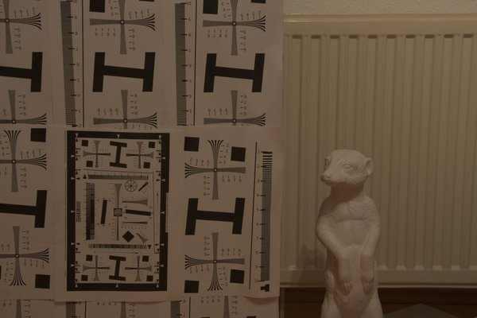
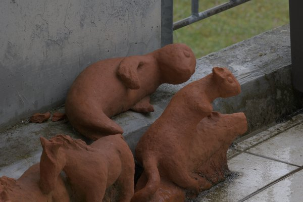
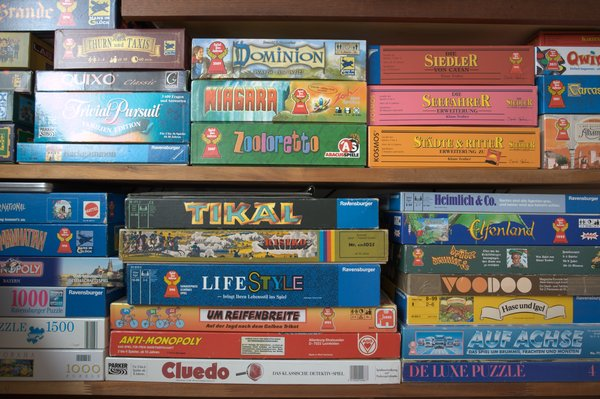
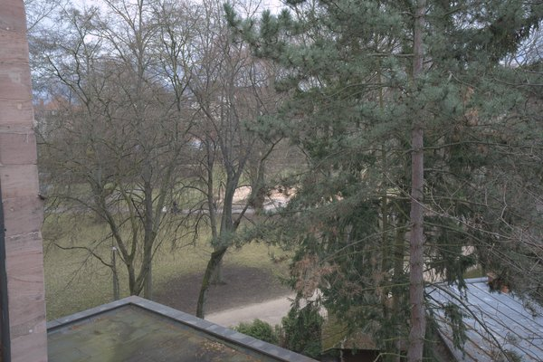
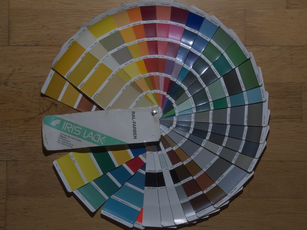
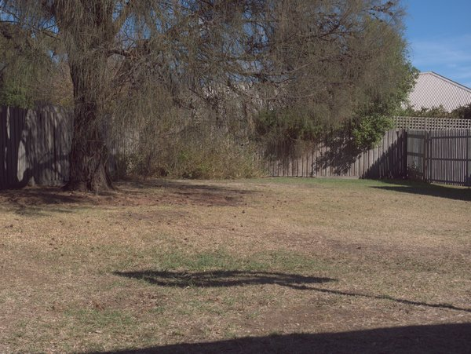
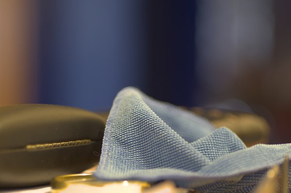
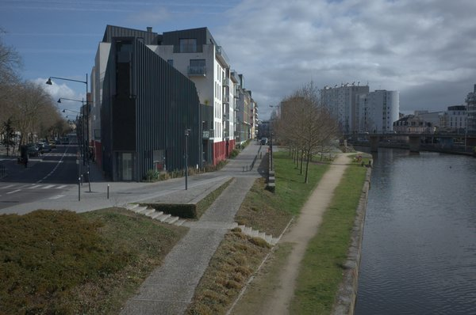
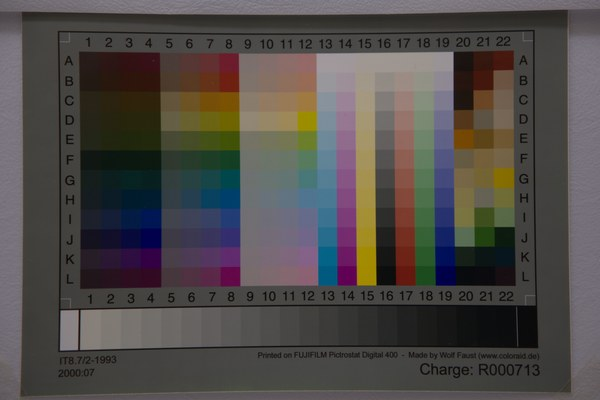

<div align="center">


# Autoshop

**AI-assisted automatic development of RAW photographs.**

An AI decides *what to change*. A deterministic Rust engine *does* it.
**The AI never touches a pixel.**

[Download v0.33.0](https://github.com/skymanbp/autoshop/releases/tag/v0.33.0) ·
[Architecture](docs/ARCHITECTURE.md) ·
[Roadmap](docs/ROADMAP.md) ·
[MIT](LICENSE)

</div>

---

## Contents

[What it is](#what-it-is) ·
[See it work](#see-it-work) ·
[Quick start](#quick-start) ·
[Feature tour](#feature-tour) ·
[Formats](#input-formats) ·
[Measured results](#measured-results) ·
[The honesty model](#the-honesty-model-is-a-feature) ·
[Privacy & trust](#privacy--trust) ·
[Commands](#command-reference) ·
[Configuration](#configuration-env-vars) ·
[Honest scope](#honest-scope) ·
[Tech](#tech) ·
[Credits](#credits--licences)

---

## What it is

The judgement-heavy part of developing a photo is *deciding what to change* —
this sky is blown, those shadows are crushed, the white balance is too cool.
The mechanical part is *applying* it. Autoshop splits exactly there:

```
 RAW ─► decode + features ─► [vision advisor] ─► EditRecipe ─► [verifier] ─► [visual judge] ─► Rust render engine
 24 fmts  preview+EXIF+hist    looks at photo      JSON        data-only QA   scores + 1 revision      │
                                                                                                       ▼
                                                                              XMP sidecar  +  16-bit master
```

The vision model only ever emits an [`EditRecipe`](src/recipe.rs) — a small,
bounded, Lightroom/ACR-style JSON of slider values — and a deterministic engine
renders from the original RAW. Five consequences, and they are the whole point:

- **Reproducible.** The same recipe and the same RAW give the same pixels, on
  any machine, forever. Nothing is sampled, nothing is temperature-dependent.
- **Non-destructive.** Your library is opened read-only. Develop state lives in
  a per-user store keyed by the photo's own path; the RAW is never rewritten.
- **Auditable.** Every edit is ~2 KB of readable JSON you can diff, hand-edit,
  version, or throw away. Nothing about the result is locked inside a model.
- **Interoperable.** The same recipe serialises to an ACR/Lightroom `.xmp`
  sidecar, so the AI's edit opens in your catalog as adjustable sliders — and a
  sidecar Lightroom already wrote is read back the other way.
- **No hallucinated pixels.** Detail that was not in the sensor data does not
  appear. There is no upscaler, no generative "enhance" in the main path.

Three *opt-in, clearly-labelled* exceptions do touch pixels, and each one says
so on itself: AI **denoise** (SCUNet), the experimental **generative** restyle
and object removal, and **pixel heal** (which samples surrounding real pixels
and invents nothing).

---

## See it work

Three frames, developed end to end by the closed loop below — no human slider
moves, no presets. Sony A7R V, 61 MP, shot by the author. The **before** is
Autoshop's own neutral develop of the same RAW (not the camera JPEG), so the
comparison isolates what the AI decided.

Each run: an OpenAI-compatible **vision advisor** proposed the recipe, the
**`claude` CLI** verified it against the histogram and clipping statistics
without ever seeing the image, and the **visual judge** then scored the actual
render and bought exactly one guided revision — adopted only because it
re-scored higher.

### `_DSC9706` — the tonal-range frame

<table>
<tr>
<td width="50%"><br /><sub><b>Before</b> — neutral develop</sub></td>
<td width="50%"><br /><sub><b>After</b> — AI develop</sub></td>
</tr>
</table>

The widest tonal spread in the set: sunlit white brick against a fully shaded
porch wall. The recipe answers it with **Highlights −38 / Shadows +27 / Whites
+18 / Blacks −17** over a five-point S-curve, Vibrance +17 at Saturation 0,
white balance pinned to 5700 K, blue HSL luminance −12, and **two local masks** —
a linear *Hold Bright Sky* (−0.18 EV, highlights −25) and a radial *Lift Main
House* (+0.18 EV, shadows +21). It also crops 1 % left, 3.5 % top, 1.5 % bottom.

The brick reads white with its texture still resolved instead of clipping to a
flat patch, the black wall and porch open into real detail, and the blacks are
*set* rather than lifted — no grey veil. Judge 84 → revision → **86/100**,
verdict Accept, confidence 0.91. **Blemish, named:** the linear sky mask leaves
a faintly lighter band across the top-left corner if you go looking for it.

### `_DSC9711` — the detail-and-texture frame

<table>
<tr>
<td width="50%"><br /><sub><b>Before</b> — neutral develop</sub></td>
<td width="50%"><br /><sub><b>After</b> — AI develop</sub></td>
</tr>
</table>

A vertical frame of repeating lap siding, hard shadow and a diagonal railing —
the one that shows what Texture and Clarity actually do. **Texture +10 /
Clarity +8 / Dehaze +4**, Shadows +29 / Highlights −34, an S-curve with a
*lifted toe*, blue HSL luminance −16, plus two linear masks. The siding gets
warmer and board-by-board legible, the shaded tree and the railing shadows open
instead of going to mud, and the white window reveals hold. Judge 78 →
revision → **84/100**, Accept, confidence 0.87.

**Counter-example, kept in on purpose:** the sky here came out *paler* than the
neutral base, not deeper — the global toe and white-point lift outvote the
recipe's own −0.20 EV *Sky depth* mask. The recipe says one thing and the render
does another, and this README is not going to caption that as a win.

### `_DSC9712` — the establishing scene

<table>
<tr>
<td width="50%"><br /><sub><b>Before</b> — neutral develop</sub></td>
<td width="50%"><br /><sub><b>After</b> — AI develop</sub></td>
</tr>
</table>

The deepest frame — sky, hillside architecture, mid-ground greenery, foreground
road. The only one of the three where the AI reached for the **global Contrast
slider (+17) and deliberately left the tone curve empty**, with restrained
colour (Vibrance +8, Saturation −2), as-shot white balance kept, and green/aqua
HSL saturation pulled down.

This is also where the visual judge earned its cost: it scored the *first*
proposal **63/100** — «foliage turns acidic yellow-green, deep trees lose
shadow detail, uneven cyan patch at upper left» — and the guided revision came
back at **87/100**. The retaining walls, boxwoods, crosswalk and pond all gain
detail instead of reading as flat grey, and the greens are calmed rather than
acid. **Same caveat as above:** the sky is paler and milkier than the neutral
before. Two of three frames show it; it is a real behaviour of the current
global/local composition, and it is written down rather than curated away.

> **One of the four analyse calls failed**, and that is worth showing too. The
> first attempt on `_DSC9706` lost its vision arm to a transient HTTP 524 from
> the endpoint. Autoshop degraded to its histogram heuristic (exposure −0.2 EV,
> confidence 0.4), and the verifier refused it: *«Heuristic fallback recipe (AI
> vision failed); confidence 0.4 too low to auto-apply.»* No silent bad edit.
> The retry went through cleanly.
>
> **Reproducibility footnote:** the JPEGs above are downscaled from full-sensor
> renders (9504×6336 / 6336×9504). The CLI has no export-at-size flag — `apply`
> renders at native resolution only — so the resize was done outside Autoshop.
> The faint `© skymanbp` watermark protects the author's photographs and sits
> identically on both halves of every pair — it is not part of the develop.

---

## Quick start

### Download

Each tagged release ships **both** front-ends prebuilt for Windows. For
v0.33.0:

| file | size | sha256 |
|---|---|---|
| `autoshop.exe` (CLI) | 30,668,634 B | `e670f91e6480db6f639ced36af802d0c8cf899a8e9e34c022bd4e1e4e2f11db2` |
| `autoshop-gui.exe` (desktop app) | 40,290,588 B | `6c69ee3f71a2bb31e14da108b55f76a523577ea533c084362527ba9b452e00b8` |

Both digests were verified by re-downloading the published assets and comparing
them byte-for-byte against the local build.

### Or build it

```bash
cargo build --release                                    # CLI → target/release/autoshop(.exe)
cargo build --release --features gui --bin autoshop-gui  # desktop app → autoshop-gui(.exe)
cargo test                                               # unit + engine tests
```

The GUI sits behind the `gui` feature, so a plain `cargo build` / `cargo test`
never pulls in eframe + winit + the GL stack. Both binaries link the same engine
library — the desktop app is not a wrapper around the CLI, it links the crate
in-process.

Cross-platform **compilation** is CI-verified: the
[`build` workflow](.github/workflows/build.yml) compiles both feature
configurations on `ubuntu-latest` and `macos-latest` on every push (first
verified run:
[32346678287](https://github.com/skymanbp/autoshop/actions/runs/32346678287),
2026-08-20, 7m27s). That proves the source *builds* there and exactly that —
runtime behaviour on those platforms has not been verified, and prebuilt
binaries remain Windows-only.

### Three front-ends, one engine

| | how | when |
|---|---|---|
| **Desktop app** | run `autoshop-gui` and point it at a folder | the full editor — library grid, develop panel, masks, crop, versions. No server, no browser. English / 中文 |
| **Local web UI** | double-click `Autoshop-UI.bat`, or `autoshop serve "…\photos" --port 8080` | a quick gallery on `127.0.0.1` with live before/after and a text direction box |
| **CLI** | `autoshop auto "photo.ARW" --guidance "warm golden-hour, lift shadows"` | scripting, batches, evaluation, CI |

### What needs a key, and what does not

| runs **without any API key** | needs a vision key |
|---|---|
| the whole render engine (`apply`) | `analyze` / `auto` (the AI proposal) |
| **`match`** — reverse-fit a finished look into an editable recipe | the visual judge and `--ai-judge` / `--deep` |
| XMP read + write, mask import/export | `reimagine` / `retouch` (generative) |
| crop, masks, curves, every slider in the GUI | AI auto-detect in `heal` (painting a mask works offline) |
| **AI denoise** (local SCUNet on your GPU) | |
| local AI mask re-derivation (SAM 2.1 / OneFormer / U²-Net) | |
| style indexing and retrieval | |

The **verifier** role needs no API key at all when it runs over OAuth: it shells
out to the `claude` CLI you are already signed in to. Without a vision key,
`analyze` falls back to a histogram heuristic and *says so* in the rationale —
which, as the failure above shows, the verifier is entitled to refuse.

---

## Feature tour

### One-shot develop, with a visual closed loop

`auto` decodes a RAW, asks the vision advisor for an `EditRecipe`, has the
verifier acceptance-check it against EXIF/histogram/clipping statistics
(**data-only — the verifier is never sent pixels**), then renders a 16-bit TIFF
master. Since v0.26.2 the interactive surfaces close the loop *visually*: the
proposal is rendered and scored by the vision model, which may buy one guided
revision — adopted only if it re-scores at least as high. `batch` and `eval`
skip the paid loop, and the rationale discloses every branch taken.

### XMP sidecars, both directions

The recipe serialises to an ACR/Lightroom `.xmp`: global sliders, Texture, the
Detail axes, de-fringe, post-crop vignetting and grain, local linear/radial
masks with their own point curves, and the Transform/Calibration blocks carried
verbatim. The XMP layer is hand-rolled ([`src/xmp.rs`](src/xmp.rs)) and *merges
into* an existing document, preserving byte-for-byte everything this engine does
not model — a serialise-from-a-DOM round trip cannot promise that.

Reading back is the harder direction, and v0.31.0 fixed a real hole: **every**
Lightroom mask used to be discarded on import, because LR writes `crs:Angle` and
`crs:MaskBlendMode` on all of them and either one was enough to drop the whole
correction. On the 7-file forensic corpus that is now 42 of 42 corrections
imported, 0 refused.

Lightroom's **AI masks** (Sky / Subject / Object) arrive too — but as a
*re-derivation*, not an import. The sidecar carries only the intent and the click
point, never a raster, so the alpha is recomputed here by a local segmenter and
**every surface says so** rather than letting it pass for Adobe's own mask.

### The radial mask geometry is measured, not guessed

Twelve purpose-shot Lightroom exports plus pixel measurement of the results
settled what `Mask/CircularGradient` actually means. `crs:Top/Left/Bottom/Right`
is **not a bounding box**: it is the pair of *rotated corners* of the ellipse's
own box, in pixel space. Reading it naively — which this app, and every other
implementation we could find, did — gets the axis ratio wrong by a median factor
of **1.84** and leaves 8 % of real masks unreadable. Sixteen real sidecars now
round-trip their corners byte for byte.

The method policy, stated once so it can be cited: every piece of format
knowledge here comes from **behavioural measurement** — sidecars and exports of
the author's own photographs from the author's own Lightroom, compared at the
XMP and pixel level. Nothing was decompiled or disassembled. The one published
decompile-derived model in this space (of the brush alpha kernel) is precisely
what this project **refuses** to build on.

The follow-up round then **refuted one of its own constants**, which is the part
worth reading. The `1.032` frame scale measured in v0.32.0 turned out to be one
frame's Adobe *lens-profile warp* mistaken for a universal affine — proven by a
`LensProfileEnable` A/B export and an 11-dab displacement field. In v0.33.0 it
is **1.0**: an imported radial renders at the geometry the sidecar actually
stores, instead of 3.2 % dilated. The residual on any frame is now that frame's
own unmodelled lens warp (0–3.4 % observed), and an `.lcp` reader is the named
candidate fix.

### Local masks

Linear gradients, radials (rotatable), free-form rasters, AI-selected subject /
sky / object, add–subtract–intersect shape composition, per-mask eye toggle and
duplicate, per-mask point curves, brush-editable AI rasters with
feather / expand / contract and full-resolution guided refine.

**Brush masks are the honest exception.** Lightroom's dab-stream brush groups
are imported, carried and written back byte-exact — and **rendered nowhere**.
The engine's `mask_weight` answers 0 for that geometry, and both the import and
the export disclose it by name (`BrushCarried`). The alpha model is now largely
measured — screen accumulation, density as a pre-screen scale, a one-parameter
flow law (κ = 0.1219 ± 0.0027), an 11-rung hardness kernel table — but the
kernel has no closed form and the mask lives in Lightroom's *pre-lens-correction*
frame, which this engine cannot yet reproduce. Drawing it anyway would mean
burning pixels at a position known to be wrong. Autoshop's *own* painted and
AI-derived rasters are a different thing entirely and do render.

### Style retrieval and the two taste dials

**Style** learns from *similar* past edits you have made (k-NN over EXIF +
histogram, optionally a SigLIP 2 image embedding) and offers them to the advisor
as soft reference. Build the index from the GUI, the web panel, or
`autoshop style-index <dir>`; every analysis names the shots it actually leaned
on.

**Strength** is the second, independent dial: *Style* asks how close to your own
past edits, *Strength* asks how committed the result should be. One value drives
all six places that used to decide restraint on their own — the proposer's
numeric guardrails and wording, the recipe's soft caps, the verifier's two-sided
band, the judge's rubric, whether a retrieved reference is a ceiling or a floor,
and the no-key fallback. `0.50` reproduces the calibrated *numbers* of releases
up to v0.28.0 bit-for-bit; the default `0.65` pushes a little further; above
`0.70` the AI is told to commit. **The clipping and white-point safeguards never
move with it.**

### Look matching (reverse-fit) — no API key

`match` takes the same frame twice — your source and a finished rendition of it
(a Lightroom export, the camera JPEG, a `reimagine` output) — and *solves* for
the `EditRecipe` that reproduces it through the engine: CDF tone matching, then
saturation, then colour cast. No pixels are copied, so the fit applies at full
sensor resolution and writes `recipe.json` + XMP. Deterministic and key-free.

Two honesty readings ride every fit: the frame-global look residual, and a joint
distribution check over luminance × chroma ranges which **can only lower the
reported confidence, never raise it**. Opt-in AI review (`--ai-judge`) scores
how faithfully the fitted render matches the target; opt-in `--deep` lets that
review *act*, buying one guided retry that is kept only if it re-scores at least
as high.

### AI denoise (SCUNet, GPU)

ACR/LR-style denoise for high-ISO and astro frames, via a local Python sidecar.
Off by default; triggered by `--denoise`, the `denoise` command, or a UI button.
Runs entirely on your machine.

<div align="center"></div>

### Parallel batch and self-evaluation

`batch` processes a folder; `eval` runs the AI against RAWs that have your own
`.xmp` beside them and reports per-control error and bias. Both take `--jobs N`,
**capped by a memory budget**: one 61 MP photo's pipeline pass peaks at ~1.8 GB
of commit charge (measured, not guessed), so the worker count is bounded by free
memory — and the run *discloses* when the cap overrules your flag. The 147-photo
eval went from ~2.3 h serial to a measured **38 min** at `--jobs 3`. Transcripts
are index-ordered, so re-running the same folder gives the same record.

### PNG/TIFF source mode

Feed an already-processed image — denoised in Lightroom, exported from
Photoshop — and Autoshop grades it directly. Auto-detected by file type; no RAW
required. Embedded ICC profiles (LR's "Edit in…" exports ProPhoto 16-bit by
default) are normalised into the sRGB working space with 16-bit depth preserved,
instead of being read as if they were sRGB.

### Experimental pixel modes

`reimagine` (generative restyle) and `retouch` (generative object removal) go
through OpenAI Images and are labelled experimental everywhere. `heal` is the
*non*-generative retoucher: it removes dust, blemishes and specks by sampling
**surrounding real pixels** and invents nothing.

---

## Input formats

<table>
<tr>
<td align="center"><br /><sub><b>.cr2</b> · Canon EOS 40D</sub></td>
<td align="center"><br /><sub><b>.cr3</b> · Canon EOS R6</sub></td>
<td align="center"><br /><sub><b>.nef</b> · Nikon D700</sub></td>
</tr>
<tr>
<td align="center"><br /><sub><b>.arw</b> · Sony α7 III</sub></td>
<td align="center"><br /><sub><b>.orf</b> · Olympus E-M5</sub></td>
<td align="center"><br /><sub><b>.rw2</b> · Panasonic DMC-GX85</sub></td>
</tr>
<tr>
<td align="center"><br /><sub><b>.pef</b> · Pentax K-5</sub></td>
<td align="center"><br /><sub><b>.dng</b> · Ricoh GR II</sub></td>
<td align="center"><br /><sub><b>.raf</b> · Fujifilm X-S10 — X-Trans, approximate</sub></td>
</tr>
</table>

<sub>Nine cameras, one per format, each a **full neutral develop** by
`autoshop apply` from a CC0 sample file — not the camera's embedded preview.
The `.raf` tile is the honest one: X-Trans is demosaiced through the Bayer path,
and on this sample the develop also comes out visibly green and dark against the
camera's own preview of the same bytes (measured channel means 53.6/82.9/39.9
versus 110.2/104.9/99.8, where the other eight formats all land within
G/R 0.81–1.08). The as-shot white balance reads correctly, so the suspect is the
Bayer-on-X-Trans channel mapping. See [X-Trans, restated](#x-trans-restated).</sub>

**Camera RAW — 24 extensions**, one predicate app-wide (`decode::is_raw`):

```
arw dng raw raf nef cr2 cr3 orf rw2 pef srw 3fr fff iiq
mef mos erf kdc dcr dcs crw nrw mrw ari
```

**Baked rasters — 8 extensions:** `png tif tiff jpg jpeg webp bmp gif`. All
decoders are pure Rust. AVIF and HEIC are **deliberately excluded** — they need
a C toolchain, and this tree has no C build dependency and keeps none.

Decoding is `rawler` 0.7.2, which carries **725 camera models**. An extension
being on that list means the file reaches the RAW engine — not that your
particular body is in the database. **Nine cameras, one per format, are verified
end to end** on CC0 sample files, and that zoo is a release gate
(`AUTOSHOP_RAW_ZOO`, 9/9 at v0.33.0).

**If your camera is not recognised**, or its format is not listed: run the file
through the free **Adobe DNG Converter** and open the `.dng`. That is not a
second-class path — rawler builds a DNG's entire camera profile, colour matrices
included, from the file's own tags, so a converted file needs no database entry
at all. Autoshop's error message says this too, with the file named.

`.x3f` (Sigma Foveon) is **permanently excluded**: rawler 0.7.2's metadata reader
for it is a literal `todo!()`, which panics.

---

## Measured results

Autoshop grades itself against the photographer's own edits. `eval` takes RAWs
that have your Lightroom `.xmp` beside them, runs the full AI pipeline, and
reports per-control error and bias plus one aggregate **gap score** — the mean
per-control divergence including the tone curve, where lower means closer to
your look.

The current baseline, re-run on all **147 pairs** at v0.33.0 (an
OpenAI-compatible endpoint, `--jobs 3`, 147/147 completed, **zero fallbacks**,
~38 minutes):

| metric | value |
|---|---|
| **Overall gap score** | **15.5 %** |
| Mask-import refusals | **2.35 → 0.05 per photo** |
| `whites` bias | +22.55 → **+16.20** |
| `blacks` bias | −14.18 → **−10.87** |

The mask row is the one to read twice. Before the v0.31.0 import fix, `eval`
counted 2.35 of the photographer's own masks *refused by our importer* on the
average photo — a number the tool reported about itself, on its own corpus,
because the refusal was counted rather than swallowed. That is what got fixed,
and this is the proof on the full corpus.

The remaining bias is real and unresolved: the AI still sets `whites` about 16
points higher and `blacks` about 11 points lower than this photographer does.
That is a taste gap, stated as a number instead of a claim.

**Release gates at v0.33.0** (both build configurations): clippy clean ×2;
695 library (8 `#[ignore]`d forensic probes) / 10 CLI / 131 GUI / 2+2 contract
tests; 16/16 real Lightroom radial sidecars byte-round-tripped; 42/42 mask
imports on the forensic corpus with 0 refusals; RAW zoo 9/9; font subset
803/803 glyphs; i18n audit 0 findings. A doc-drift gate
([`scripts/check_docs.py`](scripts/check_docs.py)) re-derives every hard number
in these docs from the tree before each release.

---

## The honesty model is a feature

Most of the interesting engineering in this project is in what it **refuses to
pretend**. Every degradation has a name, and that name reaches every front-end —
the desktop app's open banner, the web reply, and `analyze` / `auto` / `match`
on stderr beside the `xmp ->` line.

| what | what Autoshop does |
|---|---|
| **Mask import losses** | Named, not counted: `brush mask(s) carried, not yet rendered`, `AI mask(s) re-derived by the local segmenter - not Adobe's own raster`, `radial rotation(s) read as 0`, `local point curve(s) unreadable`, `unmodelled local slider(s)`, `unknown local setting(s)`, and more |
| **Mask export losses** | The same list in the other direction — a mask this engine drew that the sidecar cannot carry says which one and why |
| **Brush masks** | Carried byte-exact, rendered nowhere, disclosed on both directions. Not silently drawn approximately |
| **AI masks** | The alpha is **recomputed** by the local segmenter and every surface says so. Never passed off as Adobe's raster |
| **No embedded preview** | 12 of the 24 formats store none. Those degrade to Autoshop's own neutral develop *and say so* — you are told you are looking at our render, not the camera's |
| **X-Trans** | Disclosed on every render (see below) |
| **Untagged 16-bit input** | Read as sRGB, and flagged — right for 8-bit JPEG, often wrong for the 16-bit files an editor produces |
| **Unsupported sensors** | Monochrome and 4-colour (CYGM/RGBE) arrays are **refused before the develop**, not after it |
| **Refusal causes** | Unknown make, unknown model and no decoder are three different failures with three different messages, each offering the DNG on-ramp |
| **Parser panics** | A third-party decoder panic becomes a named error; the process survives, so one bad file cannot kill a `batch` run |
| **Carried, not rendered** | Every control declares which of three things it is (below). No control moves a number without either moving a pixel or admitting that it doesn't |
| **Memory cap** | When the `--jobs` budget overrules your flag, it prints a line. A silent downgrade reads as "the flag didn't work" |
| **AI fallback** | A failed vision call degrades to the histogram heuristic with `confidence 0.4` — and the verifier is allowed to refuse it, as it did in the showcase above |

Each control is exactly one of three kinds, and the registry states it once:

- **Rendered** — drawn here approximately and written to the sidecar. The
  ordinary sliders.
- **Carried, not rendered** — written to the sidecar; the canvas deliberately
  does not draw it, because the operator behind it is unpublished and
  approximating it would mean putting an operator *we invented* between you and
  your picture. Film grain, the post-crop vignette family, the Sharpen and
  Noise-Reduction detail axes, colour noise reduction, de-fringe, the auto-CA
  switch, `crs:Roundness`, `crs:Midpoint`.
- **Passed through verbatim** — the Transform/Upright and Camera Calibration
  blocks, carried byte-for-byte and never interpreted, which is why the app
  shows their values and offers no slider for them.

### X-Trans, restated

Non-Bayer colour filter arrays develop through the Bayer path, because rawler
0.7.2's demosaic guard checks the pattern's *name* rather than its geometry, so a
6×6 X-Trans mosaic is reconstructed as if it were a 2×2 quincunx. Autoshop
discloses this on every such render.

The disclosure's current wording asserts that «colour, tone and framing are
unaffected» and only fine detail is approximate. **On the Fujifilm X-S10 zoo
sample that clause does not hold** — the measurement is in the format-strip
caption above. The as-shot white balance is read correctly, which points at the
channel mapping rather than the metadata. This is an open defect, the sample is
shipped in the strip rather than quietly swapped for a prettier one, and the
disclosure string should stop promising unaffected colour until it is fixed.

---

## Privacy & trust

**Your photos never leave your machine except to the AI endpoints you
configured**, and only when you ask for an AI operation. Everything else —
render, XMP, masks, denoise, segmentation, style indexing, reverse-fit — is
local.

- **`store: false` on every AI request body.** Nothing you send persists in the
  key owner's account. There is a unit test asserting it on every frame,
  including the style reference image, because a stored response is an exfil
  channel.
- **The verifier never sees pixels.** It judges the recipe against EXIF,
  histogram and clipping statistics plus the advisor's rationale.
- **The local server is loopback-only and hostile to the rest of your browser.**
  `serve` binds `127.0.0.1`, refuses any request whose `Host`/`Origin` is not
  that exact loopback authority *on its own port*, requires the page's per-run
  session token on every state-changing request, marks all `/api/*` responses
  `no-store`, never returns a key (settings answer `key_present: true/false`),
  and sends `X-Frame-Options: DENY` so a page you visit cannot frame the UI.
- **Your library is read-only.** The engine refuses to write into a source RAW's
  folder. Exports go to `./out` or a destination you choose; develop state lives
  in a per-user store keyed by path hash, so two same-named photos never collide.
  The one deliberate exception is «Export .xmp beside the photo» — a per-photo
  click, never batched, that refuses to replace an existing `.xmp` without a
  second confirming click, because beside the photo is the only place Lightroom
  reads one.

### A settings file in the current directory is not trusted with your key

Autoshop reads an `autoshop.local.json` sitting in the folder it was launched
from — that is the pre-store layout, kept so old setups keep working — but since
v0.18.0 such a file may only choose models and providers. Settings resolve per
**field**, so a file supplying just `image_base_url` would have redirected the
endpoint while your real key still came from `.env`, and the next Analyze would
have posted that key to whoever wrote the file. Extracting a shared archive of
photos and running Autoshop inside it was enough.

Since v0.23.2 that rule is stated **once**, as a property of each setting
(`config::SETTINGS`), rather than as three hand-kept lists:

| kind | examples | who may set it |
|---|---|---|
| **secret** | `OPENAI_API_KEY`, `AUTOSHOP_ANALYSIS_API_KEY` | your environment, your `.env`, the Settings panel |
| **destination** | the two base URLs, `AUTOSHOP_CLAUDE_BIN`, `AUTOSHOP_PYTHON`, the sidecar scripts and weight cache, `AUTOSHOP_DATA_DIR`, `PATH`, `PYTHONPATH`, `PYTHONHOME`, `ANTHROPIC_*` | your environment and the Settings panel **only** |
| **preference** | every model id, both provider selectors, both reasoning-effort tiers, the tuning numbers | anything, including an ambient file |

So keys and **models** from a `.env` work, while nothing ambient can name where
bytes go, which account pays, or what program runs. Two further routes were
closed with it: **saving settings no longer launders an ambient file into your
trusted one** (both writers read-merge-write, so one ordinary "save" used to
copy a planted base URL into your user profile), and **a `.env` may no longer
choose the endpoint** — `dotenvy` searches every parent directory and its
override mode beats a variable you really set.

One place the table deliberately does *not* apply: what a `.env` may push into
the child processes (the `claude` verifier and the Python sidecars). There,
"unlisted" is not a closed set — it includes every loader hook the platform
defines — so that block is an **allowlist** of compute knobs
(`CUDA_VISIBLE_DEVICES`, thread counts, the offline flags). Anything else a
`.env` names is dropped, and the app says which. Your own environment is
unaffected: the children inherit it.

A saved key also remembers **which endpoint it was saved for**. The two image
providers share one key slot, and flipping providers swaps the base URL — which
used to leave the previous key armed for the new endpoint. Each save now records
the base the key was typed beside, and the key is simply not sent anywhere else.
Keys from your environment are exempt; that pairing is your own.

Bundled Python sidecar scripts and the weight cache resolve against the
**program's own directory tree**, never the folder you run from — an unzipped
photo pack cannot substitute its own `denoise.py` or its own weights.

---

## AI setup

Two roles, each configurable in the in-app **Settings (⚙)** panel or via env:

| Role | What it does | Default | Other option |
|------|------|---------|--------------|
| **分析 / Analysis** (verifier) | data-only acceptance check of each recipe | **OAuth** — the `claude` CLI on PATH, signed in (reuses Claude Code OAuth, **no API key**), model `opus` | **API** — any OpenAI-compatible chat endpoint (base URL + key + model) |
| **图像 / Image** (vision advisor) | looks at the photo → `EditRecipe` | **API** — `OPENAI_API_KEY`, model `gpt-5.5` | any OpenAI-compatible **vision** endpoint. Without a key, a histogram heuristic is used |

The `claude` CLI has no image input in print mode, so the image role always
speaks the OpenAI-compatible HTTP protocol. The Settings panel's "OAuth" choice
for the image role is a preset that points the endpoint at a local subscription
bridge instead of a keyed API — same wire protocol, different
endpoint/credentials.

Keys and models are written to `autoshop.local.json` in your per-user Autoshop
folder (never in a repo), which overrides the environment. You can also use a
`.env`:

```
OPENAI_API_KEY=sk-...
```

Reasoning effort is a **suggestion, not a contract**: the tiers differ per
provider (the `claude` CLI documents `low, medium, high, xhigh, max`;
OpenAI-compatible endpoints take the first three), so the pickers offer the
right list beside a free-text field, and an endpoint that does not know the tier
is automatically retried without it. Blank means "send no such parameter" — the
only correct request for a model that does not reason — and a blank *saved in
Settings* is a real choice that silences an `AUTOSHOP_*_EFFORT` from the
environment. The model lists beside those pickers are whatever the endpoint's
own `/models` returned, minus the ids recognisable as something else; a name can
only rule things OUT, so a wrong pick fails loudly, and unbilled, on the first
call.

### AI denoise setup

The denoiser is a Python sidecar ([`python/denoise.py`](python/denoise.py))
running **SCUNet** on the GPU. It needs Python with:

```bash
pip install torch --index-url https://download.pytorch.org/whl/cu128   # CUDA build
pip install opencv-python numpy einops requests
```

On first use it downloads model weights (~72 MB each) into `python/weights/`
(gitignored), gated on sha256 **and** an exact byte count. Trigger it via
`autoshop auto --denoise`, `autoshop denoise <src>`, or the **AI Denoise**
checkbox in the UIs. Models: `color_real_psnr` (default, blind, best for real
high-ISO/astro), `color_real_gan`, `color_15/25/50`.

---

## Command reference

```
autoshop decode  <src>                       # preview + EXIF + histogram
autoshop analyze <src> [--guidance "..."] [--style 0..1] [--strength 0..1]   # AI → recipe.json + .xmp (no render; incl. visual review loop)
autoshop apply   <src> <recipe.json> -o out  # render a recipe to an image
autoshop auto    <src> [--denoise] [--guidance "..."] [--style 0..1] [--strength 0..1]   # analyze + render, end-to-end
autoshop denoise <src> [--strength 0..1] [--model ...]  # AI denoise → clean 16-bit master
autoshop batch   <dir> [--render] [--limit N] [--jobs N] [--include-baked]  # a whole folder (--jobs = photos in flight, default 3)
autoshop eval    <dir> [--limit N] [--jobs N]  # compare AI edits vs your own .xmp (--jobs default 1 = serial)
autoshop style-index <dir>                   # build the "your taste" reference index (also in the GUI: AI panel › Style reference library)
autoshop serve   <dir> [--port 8080]         # local web UI
autoshop reimagine <raw> --prompt "..."      # experimental generative restyle
autoshop match   <raw> <target> [--render] [--zoned] [--ai-judge] [--deep]  # reverse-fit a look → editable recipe + XMP (no key; --ai-judge scores the match and --deep lets it buy one guided retry, both need a key)
autoshop retouch   <raw> --mask m.png --prompt "..."    # experimental generative object removal
autoshop heal      <src> [--mask m.png] [--no-auto]     # pixel heal: spot/blemish removal (NOT generative)
autoshop recipe-schema                       # print the EditRecipe JSON shape
```

`<src>` is a RAW **or** a baked image — the develop pipeline runs on either.
RAWs also get an `.xmp`; baked sources get `recipe.json` only, because XMP is
meaningful only for RAW in Lightroom. `batch` skips baked photos by default and
takes `--include-baked` to opt in: shooting RAW+JPEG is common, and analyzing —
and **billing** — the camera JPEG beside every RAW is not a default.

---

## Configuration (env vars)

The AI-provider rows are also settable in the **Settings (⚙)** panel; the
per-user `autoshop.local.json` overrides the environment. The two sidecar knobs
(`AUTOSHOP_PYTHON`, `AUTOSHOP_DENOISE_MODEL`) are environment-only.

| Variable | Default | Purpose |
|----------|---------|---------|
| `OPENAI_API_KEY` | — | image (vision) advisor + generative key |
| `AUTOSHOP_OPENAI_MODEL` | `gpt-5.5` | image/vision model id |
| `AUTOSHOP_OPENAI_BASE_URL` | `https://api.openai.com/v1` | image API base (any OpenAI-compatible) |
| `AUTOSHOP_OPENAI_IMAGE_MODEL` | `gpt-image-1.5` | generative (retouch/reimagine) model |
| `AUTOSHOP_ANALYSIS_PROVIDER` | `oauth` | verifier provider: `oauth` (claude CLI) or `api` |
| `AUTOSHOP_ANALYSIS_MODEL` | `opus` | verifier model (claude alias for oauth; chat id for api) |
| `AUTOSHOP_ANALYSIS_API_KEY` | — | verifier key when provider = `api` |
| `AUTOSHOP_ANALYSIS_BASE_URL` | `https://api.openai.com/v1` | verifier API base when provider = `api` |
| `AUTOSHOP_IMAGE_EFFORT` | — | image-role reasoning effort; blank ⇒ the provider decides |
| `AUTOSHOP_ANALYSIS_EFFORT` | — | verifier reasoning effort; blank ⇒ the provider decides |
| `AUTOSHOP_DATA_DIR` | `%LOCALAPPDATA%/autoshop` | the develop store root (recipes, XMP, versions, mask rasters) |
| `AUTOSHOP_PYTHON` | `python` | interpreter for the ML sidecars (denoise / segment / embed) |
| `AUTOSHOP_DENOISE_MODEL` | `color_real_psnr` | default SCUNet weights |
| `AUTOSHOP_EMBED_SCRIPT` | bundled `python/embed.py` | style-embedding sidecar (SigLIP 2) |
| `AUTOSHOP_STYLE_EMBED` | off | opt in to SigLIP 2 style embeddings — the first run downloads **1.50 GB** of weights, so this is never taken without being asked |
| `AUTOSHOP_STYLE_EMBED_WEIGHT` | `2.0` | weight of the embedding block in the retrieval distance; `0` reproduces the pre-embedding ranking exactly. **Not calibrated** — the value was chosen, not measured |

---

## Honest scope

- **Render ops are tasteful approximations of Lightroom, not bit-exact.** Which
  control is *rendered*, *carried* or *passed through verbatim* is stated per
  control — see [the honesty model](#the-honesty-model-is-a-feature).
- **Radial masks have named remaining gaps.** `crs:Roundness` and `crs:Midpoint`
  are carried and never rendered — every radial reachable here writes their
  defaults and current Lightroom has no slider for either on a radial, so there
  is nothing to calibrate against. `|Angle| > 45°` is untested. A sidecar that
  declares no frame size still exports a rotated radial *unrotated*, because the
  pixel↔normalised fold needs the aspect — and the save says so in those words.
  The feather falloff law was **refuted at both endpoints** by direct
  measurement this round; two measurements of the outer endpoint are not yet
  reconciled, and the engine's ramp is deliberately left where it is until they
  are.
- **Imported radial geometry changed in v0.33.0.** Previous builds dilated every
  imported radial by 3.2 %. They now render at the sidecar's stored geometry.
  Renders of the same recipe differ across that boundary; version snapshots keep
  the old one.
- **Every Sony ARW render moved by (32, 20) px in v0.32.0.** The develop window
  now starts at the RAW's own `DefaultCropOrigin`, where the camera and Lightroom
  put the picture, instead of the sensor's top-left corner.
- **Forward compatibility breaks at v0.33.0.** A v0.32.0 binary **hard-refuses**
  a v0.33.0 recipe carrying a 90° rotation, a brush mask or an AI mask — a loud
  schema refusal by design, never a silent drop. Recipes using none of those
  serialise byte-identically and stay readable both ways.
- **AI denoise runs on the demosaiced RGB**, not the raw Bayer mosaic like Adobe
  Denoise, and takes ~3 min for a 60 MP frame on an RTX 4060 Ti. Excellent, not
  identical to Adobe.
- **Kelvin white balance is absolute only on a RAW**, where the as-shot
  temperature is read from camera metadata. A baked PNG/TIFF has no as-shot
  reading, so the slider anchors at 5500 K and acts as a relative shift — it
  moves pixels, it just cannot claim to be the scene's true colour temperature.
- **The blackbody curve behind the Temp slider was repaired**, and that changed
  white-balance gains. The published piecewise fit's branches did not meet: at
  6600 K green jumped 1.31 % and blue 0.96 %, and red sat clamped flat from 6600
  to 6688 K, so an 88 K band carried no temperature signal at all. Measured
  against a 5500 K shot, as the change in each channel's gain:

  | Temp target | red | blue |
  |---|---|---|
  | 2000 K (candle — the slider's floor) | 0 % | **−4.43 %** |
  | 2500 K | 0 % | −0.67 % |
  | 3000–5000 K | 0 % | −0.32 % … −0.03 % |
  | 6500 K and below | **0 %** | +0.03 % |
  | above 6600 K (any cool target) | **+3.19 %** | **+2.35 %** |

  Re-exports of older work at those settings will differ by that much, and this
  change has **not** had visual acceptance.
- **Generative `reimagine` is a low-res, lossy re-render** — an experiment, not
  a master. `retouch` regenerates only the masked region and composites it back
  onto the source's own develop with a feathered seam, so the rest of the frame
  keeps its original pixels. That base is the **engine's own neutral develop**,
  capped at 2048 px on the long edge by default, never the camera's embedded
  JPEG. `--full-res` composites at full resolution instead (slow).
- **Pixel heal removes only small defects** — dust, blemishes, specks — by
  sampling surrounding real pixels. Best on fairly uniform backgrounds (sky,
  skin, wall, water); busy backgrounds heal approximately. AI auto-detection
  needs the vision key; painting a mask works offline.
- **There is no export-at-size command.** `apply` renders at native resolution;
  resizing for the web happens outside Autoshop.

---

## Tech

Rust (rustc/cargo 1.94, edition 2024) · `rawler` (RAW decode, 24 formats /
725 bodies) · `image` (pure-Rust codecs, opt-in one at a time) · `qcms` (ICC →
sRGB for baked imports) · `rayon` (row-parallel per-pixel stages) · `clap` ·
`serde` · `ureq` · `eframe`/`egui` (desktop GUI) · `tiny_http` (local web UI,
one `include_str!`'d HTML file, zero build step, zero CDN) · a hand-rolled XMP
reader/writer with no XML crate, because a Lightroom sidecar must be *merged
into*.

Five ML models run locally through three Python sidecars, none of them shipped
in this repository — the weights are fetched on first use and pinned:

| model | job | licence |
|---|---|---|
| **SCUNet** ×5 | AI denoise | Apache-2.0 (KAIR) |
| **U²-Net** | subject segmentation | Apache-2.0 |
| **OneFormer** ADE20K Swin-L | sky segmentation | MIT |
| **SAM 2.1** Hiera-Large | point-prompted object masks | Apache-2.0 |
| **SigLIP 2** base/16 @384 | style embeddings (opt-in) | Apache-2.0 |

Licence is a selection criterion here, not a footnote: candidates whose model
cards restrict *use* were passed over even though the weights are never
redistributed — and in each case the licence-clean option was also the stronger
model.

**See [docs/ARCHITECTURE.md](docs/ARCHITECTURE.md) §5** for the complete
dependency list with each entry's reason, the two-tier weight-pinning policy,
and the rest of the design.

---

## Credits & licences

**Autoshop is MIT-licensed** — see [LICENSE](LICENSE).

**RAW format samples.** The nine files behind the format strip come from the
[raw.pixls.us](https://raw.pixls.us/) community sample repository and are all
licensed **CC0 1.0 Public Domain**
(<https://creativecommons.org/publicdomain/zero/1.0/>). Only CC0 rows of that
index were eligible; every sha256 was verified against the index before use.

| format | camera | MP | sample |
|---|---|---|---|
| CR2 | Canon EOS 40D | 10.08 | `RAW (3:2)` |
| CR3 | Canon EOS R6 | 19.96 | `3:2` |
| NEF | Nikon D700 | 12.2 | `14bit 14bit compressed (Lossless) (3:2)` |
| RAF | Fujifilm X-S10 | 26.7 | `14bit 14bit compressed (3:2)` |
| ORF | Olympus E-M5 | 16.11 | `16bit (4:3)` |
| RW2 | Panasonic DMC-GX85 | 15.9 | `4:3` |
| PEF | Pentax K-5 | 16.39 | `14bit (3:2)` |
| DNG | Ricoh GR II | 16.27 | `12bit (3:2)` |
| ARW | Sony ILCE-7M3 | 24.34 | `14bit 14bit compressed (3:2)` |

**Showcase photographs** (`_DSC9706`, `_DSC9711`, `_DSC9712`) are the author's
own, shot on a Sony A7R V — **© 2026 skymanbp, all rights reserved**. Unlike
the code, these images are **not** MIT-licensed: they are included solely to
document Autoshop's output and may not be reused without permission. Each file
carries a visible watermark and embedded copyright metadata on purpose.

**Fonts.** The GUI bundles subset Noto faces under the SIL Open Font License —
see [`assets/fonts/`](assets/fonts/) for each licence text.

**Model weights** are the property of their respective authors under the
licences in the table above; none of them are redistributed by this project.
