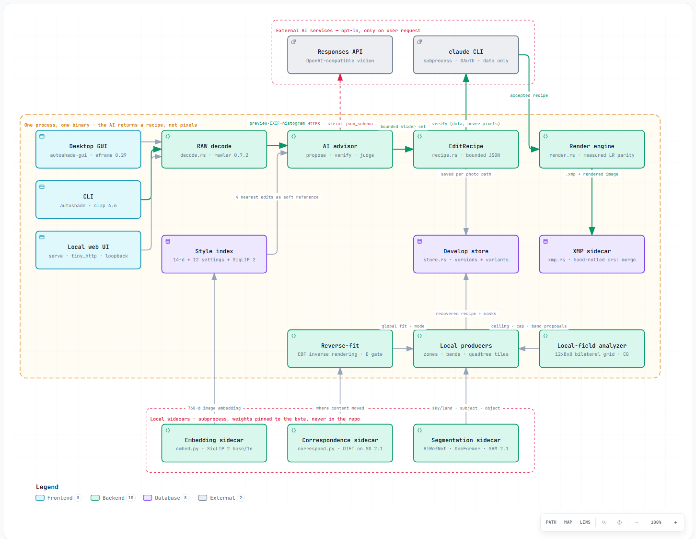
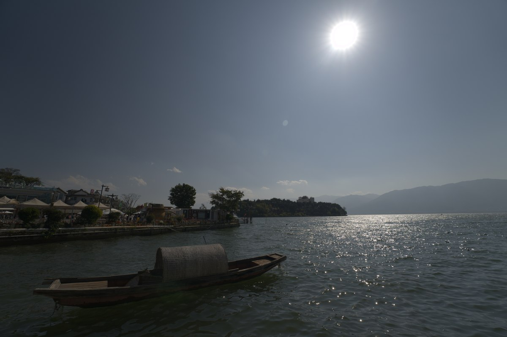
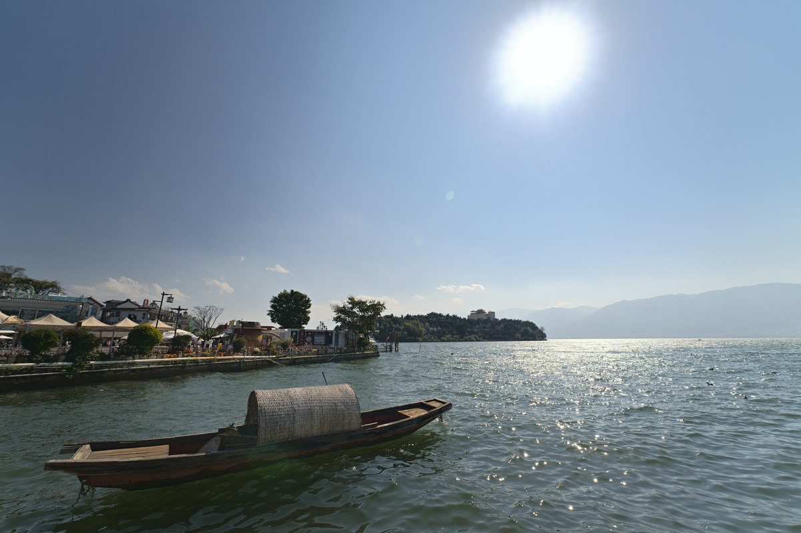
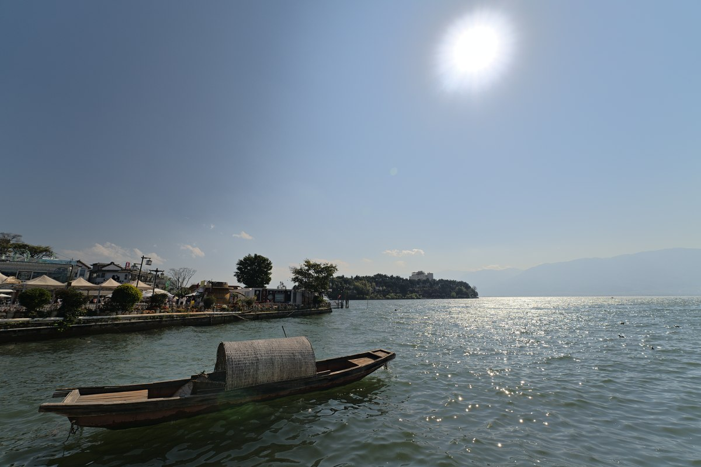
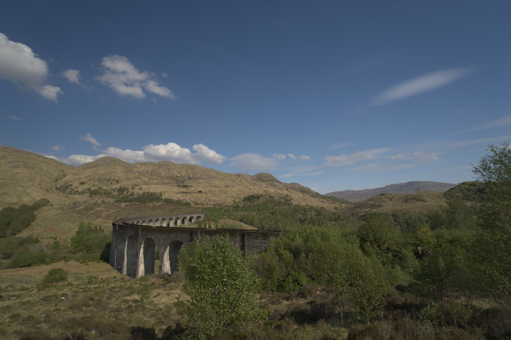
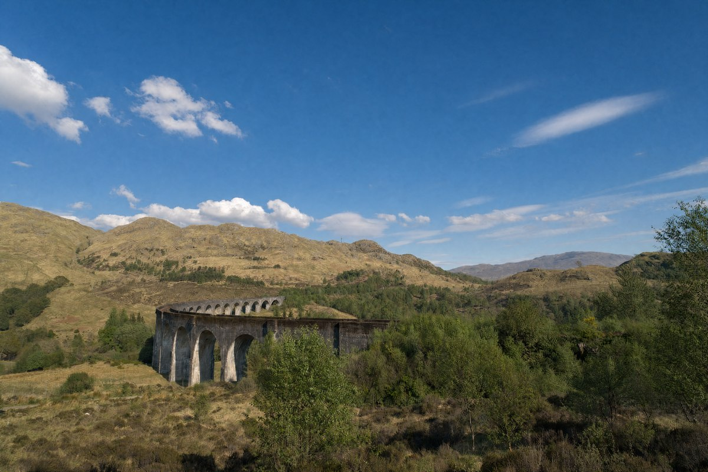
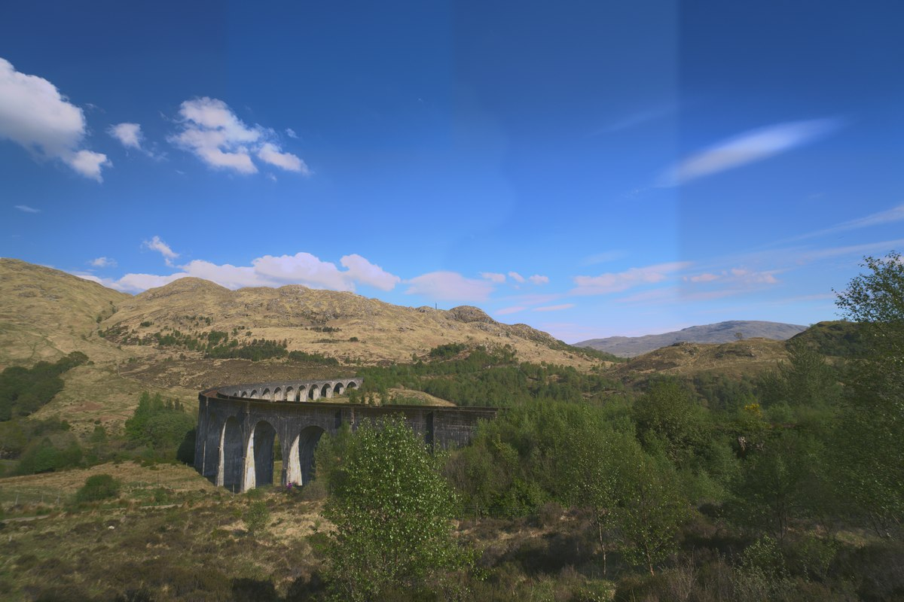

<div align="center">


# Autoshop

**AI-assisted automatic development of RAW photographs.**

An AI decides *what to change*. A deterministic Rust engine *does* it.
**In the recipe-development path, the AI never touches a pixel.**

[Download v1.0.0](https://github.com/skymanbp/autoshop/releases/tag/v1.0.0) ·
[Architecture](docs/ARCHITECTURE.md) ·
[Roadmap](docs/ROADMAP.md) ·
[MIT](LICENSE)

</div>

---

## What Autoshop is

Autoshop is a non-destructive developer for RAW and baked images. Its main
workflow turns an AI proposal into a small, inspectable `EditRecipe` — bounded
controls, a written rationale, and a confidence — and applies it with the same
local Rust renderer behind the desktop app, the CLI, and the embedded web UI.
The same recipe can be edited by hand, replayed a year later, or handed to
Lightroom. It is for photographers who want an AI first pass on a card of RAWs
without giving up an editable, Lightroom-compatible develop, and for anyone who
wants to know *what* an AI changed, in numbers, before trusting it. Generative
tools are separate, opt-in paths and are labelled as such.

## Contents

- [What Autoshop is](#what-autoshop-is)
- [What it does](#what-it-does)
- [What is new here](#what-is-new-here)
- [How it works](#how-it-works)
- [Results: two batches, six frames](#results-two-batches-six-frames)
- [Measured numbers](#measured-numbers)
- [Install and quickstart](#install-and-quickstart)
- [User manual](#user-manual)
- [Supported formats](#supported-formats)
- [Tech stack, algorithms, and design philosophy](#tech-stack-algorithms-and-design-philosophy)
- [Status, roadmap, and known limitations](#status-roadmap-and-known-limitations)
- [License and acknowledgements](#license-and-acknowledgements)

## What it does

- **Feature 1 — AI develop.** `analyze`, `auto`, or the GUI's **Analyze**: a
  vision advisor turns the preview, EXIF, and histogram into an editable
  recipe (crop, tone, white balance, curves, HSL, colour grading, texture,
  clarity, dehaze, detail, and parametric or bitmap local masks); a data-only
  verifier checks it against the image statistics; the engine renders it; one
  bounded visual-review revision may follow. Guidance text steers the proposal;
  independent Strength and Direction-adherence controls bound commitment and
  how closely the optional direction is followed.
- **Feature 2 — A deterministic develop engine.** Exposure, white balance,
  tonal controls, RGB point curves, HSL, colour grading, texture, clarity,
  dehaze, noise reduction, sharpening, vignette, crop, and lens correction, with
  linear, radial, brush, bitmap, luminance-range, and colour-range masks
  combined by Add, Subtract, or Intersect. The GUI, `apply`, and the web UI
  render through the same code; there is no hidden GUI-only look.
- **Feature 3 — Local AI masks.** Subject (BiRefNet, with a named U²-Net
  fallback), sky (OneFormer ADE20K), and point-prompted object (SAM 2.1)
  selection run as local Python sidecars with pinned weights; no API key.
- **Feature 4 — Lightroom/ACR interoperability.** Sidecar XMP is read as the
  merge base and written back with unmodeled fields preserved byte for byte;
  Lightroom brush dab streams are imported; the beside-RAW export is a
  separate, confirmed action.
- **Feature 5 — Style read.** Index your own Lightroom RAW+XMP pairs and let
  the advisor retrieve similar prior edits as soft references; a separate look
  library can retrieve finished photos through local SigLIP 2 image/text
  embeddings and zero-shot tags. Embeddings are opt-in (the GUI preference or
  `--embed`), and nothing is copied pixel for pixel.
- **Feature 6 — Reverse-fit.** `match` or the GUI's **Reverse-fit** estimates an
  engine recipe from any target look — a generated image, someone else's
  render, a reference frame — measures how far the target's *content* has
  diverged before deciding how much to trust it, then fits global, semantic
  bitmap-region, and luminance-range corrections behind evidence gates. The
  semantic producer spends one OneFormer pass per frame; the historical
  sky/land pair is the default, and up to four disjoint class regions are
  opt-in, each selecting Full or Atmosphere independently. The recovered recipe
  applies deterministically to the original full-resolution RAW.
  The global Atmosphere honesty budget follows the same `--strength` axis.
  The shipped 0.65 default is byte-identical to the calibrated path (WB
  included) except that a direction-consistent global cast is now measured at
  every strength; below the default the budget narrows toward the zero-strength
  column; above it, WB may shrink along its fitted log-K/linear-tint manifold.
  The foreign-hue veto remains active and the weighted rotation budget opens
  from 0.05 at 0.65 to 1.0 at full strength (about 0.593 at 0.85). A WB that
  cannot pass those gates is withheld and typed in the rationale.
- **Feature 7 — Generative and pixel tools, opt-in and labelled.** Reimagine
  (gpt-image-2) creates a lower-resolution target from a prompt; retouch, heal,
  and SCUNet denoise change pixels directly. These are the only paths that can
  invent or alter scene content, and the UI marks their output as generated.
- **Feature 8 — Versions, variants, and three front ends.** Every photo keeps
  Original, AI-generated, and Reverse-fit cards with numbered snapshots in a
  per-user develop store; the desktop GUI, the scriptable CLI, and a small
  loopback web UI all link the same library.

Out of scope in this release: bit-exact Adobe rendering (parity is measured,
not identical), an exact X-Trans demosaic (the plane fit is approximate),
prebuilt Linux and macOS binaries (CI builds and tests them from source), and
colour-range semantic regions.

## What is new here

The techniques below are the ones you will not find in another RAW developer.
Every number is copied from the source or from
[docs/TECH_STACK.md](docs/TECH_STACK.md) / [docs/ARCHITECTURE.md](docs/ARCHITECTURE.md);
the last subsection lists what is designed but not yet shipped.

### 1. Style reference is retrieval over your whole catalogue, not a preset

`autoshop style-index <dir>` (or the GUI's **Style reference library**) turns
*every finished edit you ever made* — each Lightroom RAW+XMP pair — into an
exemplar ([`src/style.rs`](src/style.rs)): a 14-dimensional feature vector
from EXIF and the histogram (log/ratio dimensions z-scored, scene-type
discriminators weighted 1.5×); the 12 develop settings you actually moved
(exposure, contrast, highlights, shadows, whites, blacks, vibrance, clarity,
temperature, tint, saturation, dehaze) with your tone-curve shape (black-lift
and S-strength) and a colour-family summary; and optionally a 768-dimensional
**SigLIP 2** image embedding (`base/16 @384`) computed by a local sidecar
through the same 512-px frame the query goes through, so index and query can
never disagree.

At develop time the photo retrieves the **4 most similar past shots** with the
hybrid distance `d14 + W_EMB·(1−cos(q_img,e_img)) + W_TXT·(1−cos(q_txt,e_img)) + W_DESC·(1−cos(q_txt,e_desc))`.
The shipped `W_EMB`, `W_TXT` and `W_DESC` are the calibration harness's
winners over 196 grid rows on the real corpus (see the pinned-claims table).
A **z-scored variant** of the two text terms is built and tested — raw SigLIP
image-to-text cosines are tiny and tightly clustered, which is a real reason to
suspect the raw term — but the harness measured both variants and the raw one
won, so the raw one ships and standardisation stays one flag away. `W_LOOK =
1.0` is a normalisation rather than a measured number: the look library carries
no develop settings, so the harness's settings objective cannot see it, and
nothing else ranks looks against each other, so its scale cannot change their
order. Their
settings, curve habit and colour families reach the advisor as a *soft reference*;
the `style_pull`
(0.18 at the shipped Style 0.3, full at Style 1.0) moves the proposal toward your historical means
without copying one, and the rationale names the shots it leaned on. Strength
above 0.70 with Style below 0.85 no longer receives the old committed-tier
FLOOR wording because that floor belongs to the Style axis. It is
bounded at 5,000 RAW exemplars **and 500 looks** against one 228 MiB serialized
index envelope (5,500 x 40 KiB = 214.84 MiB), the per-record bound being derived
from the two 768-D vectors, vocabulary scores, tags, and bounded description and
measured against a maximal record of each kind. A look library is a curated set
of reference grades, not an archive. From the other
side, `match --style-prompt` extracts a reusable text style brief from a
source/target pair that `reimagine` accepts as its Direction.

Finished baked photos are indexed separately with `style-index --looks <dir>`;
they carry only image/text vectors, tags, and optional descriptions, so they can
guide the proposer but never become recipe targets or blend inputs. A look answer
is unreachable, and disclosed as such, when embedding is off or no query vector
was produced. The Direction-adherence slider has Hint, Direct, and Brief tiers;
the shipped `0.65` Direct tier preserves the historical direction block byte for
byte, while the other tiers change only its wording.

### 2. Reverse-fit: inverse rendering from any finished look

`match` recovers an editable recipe from any finished rendition of the same
frame — a generated image, an export, someone else's grade — without copying
a pixel ([`src/fit.rs`](src/fit.rs)). Because a generated target is not
pixel-aligned with its source, the solve is **distribution-level, not
per-pixel regression**: luminance CDFs are matched at the engine's own tone
knots and least-squares solved against the engine's own slider basis with a
ridge and a model-selection prior (so numerically equivalent but semantically
ruinous slider combinations lose); saturation closes by mean-chroma ratio,
secant-refined through real renders; the per-channel CDF residual becomes
red/green/blue curves admitted only through three vetoes, one of which refuses
any cast that paints a hue ≥ 45° from every target family over ≥ 5 % of the
frame. The residual tone curve places its knots uniformly in the LUT's *output*
domain, which keeps a steep camera base curve from sagging the chords by
~10/255.

### 3. A structural-divergence statistic decides how much to believe a target

Before any solve, a structural reading `D` — gradient correlation and a
five-band pyramid energy error — measures whether the target still shows the
same scene. Same scene → the Full solve above. Repainted scene (`D ≥ 0.35`) →
bounded **Atmosphere** mode: EV ±1, WB gain [0.80, 1.25], saturation ±30, a
five-point curve with slope [0.5, 1.5], no per-channel curves, confidence
capped at 0.50 — read on a *structure-blind* ruler that keeps the one-sided,
sparse and minimum-share population vetoes but stops asking replaced content
to survive. A sky that gpt-image-2 invented can still hand the original RAW its
overall tone and colour without the fit chasing clouds that were never there.
The Strength axis now governs that Atmosphere honesty budget, widening it only
when the user asks and disclosing unsupported movement at high strength. The
shipped 0.65 path remains unchanged, including an as-shot result for an
out-of-budget WB. Above default, a WB outside the gain budget is scalar-shrunk
on the renderer's Kelvin/tint manifold; its pre/post renders pass the
foreign-hue veto and a weighted rotation budget that opens linearly from 0.05
at 0.65 through about 0.593 at 0.85 to 1.0 at full strength.

### 4. Diffusion features find where the content moved

On divergent pairs the fit consults a **DIFT correspondence field** — Stable
Diffusion 2.1's UNet as a featurizer (one pass per noise draw at `t = 261` over
768² inputs, `up_blocks[1]` features, an 8-draw ensemble run one at a time to
bound VRAM) — yielding a 48×48 grid of target coordinates whose confidence is
cyclic consistency × local flow smoothness. Raw cosine is exported for
diagnostics but kept out of the confidence, so a pixel-shuffle of the same
frame stays honestly unmatchable. The field weights a Full zone's pixel pairs
by per-cell confidence and reads shifted content at its corresponded position:
an identity pair reads median confidence 1.000 at 100 % coverage; the
calibration pair's generated sky reads 0.009 (21.5 %) against 1.000 (90.5 %)
on the ground. Identity and zero-confidence fields are conservation-tested to
change nothing.

### 5. Semantic zones and luminance bands, judged on their own population

Local corrections come from mutually exclusive producers: a local OneFormer
ADE20K pass yields semantic bitmap regions (sky/land by default; up to four
disjoint class regions opt-in); when segmentation is off or
unavailable, a pure-Rust pass derives **XMP-native luminance-range bands**
from rank-paired residuals (sorted target rank slices against the current
source bin means) under an evidence gate that rejects bins before they are
run into bands. Every verdict follows the population a correction moves — a
land zone is no longer withheld because a replaced sky shares its luminance
bins — and a zone whose luminance already matches says so instead of being
dialled for a hairline gain.

### 6. Quadtree tile splitting on frozen evidence

After the zones or bands, a frozen-evidence quadtree visits the strongest
supported nodes first, stops at a 4×4 grid, and keeps a tile only when both
frames contribute ≥ 3 % evidence, original structure remains comparable, the
tile's confidence interval excludes zero, its boundary stays within the
calibrated rim budget (0.012), and the composed frame does not regress at a
zero tolerance. Tiles are ordinary editable engine bitmap masks; recipe JSON
keeps them losslessly and classic XMP omits each with a named bitmap-mask
loss rather than inventing an approximate rectangle.

After the tiles, a **free-form remainder pass** reads what the local field
still owes: 4-connected, sign-pure components of the remaining residual
(pixels already covered by an accepted tile are excluded), ranked by mass, at
most two, each through the same evidence, divergence, frame and rim gates as a
tile, and every proposal, attachment or typed refusal is written into the
rationale. Accepted masks are ordinary bitmap masks with the same recipe/XMP
semantics as tiles. On the calibration corpus every proposal was refused
downstream, so today the pass contributes disclosure, not corrections.

### 7. A bilateral-grid local field prices every local producer first

Before any local producer runs, a read-only **12×8×8 bilateral grid**
(x, y, luma) of five develop parameters (EV, three channel gains, a slope) is
solved by conjugate gradients in f64 — λ = 1 Tikhonov toward the global fit,
a Laplacian smoother, ≤ 90 iterations, weights = frozen evidence × local
structural support × unclipped — on the same analysis thumbnails and the same
ruler the fit is judged by. Its rendered residual is the **ceiling**: how much
of the remaining difference *any* spatially varying develop could reach. On
the calibration pair the global fit reads 0.0961 against a ceiling of 0.0700
and the accepted sky zone realises 0.134 of that distance. The field never
touches a pixel: it proposes luminance bands to the range producer (mapped
through the pixels that occupy them, refused when the sign disagrees), reads
whether the remainder is band-, tile-, or ramp-shaped (weighted R² against 4×4
means and a least-squares plane), halves the tile budget when the remainder is
not tile-shaped, and ends the fit early when a producer already lands within
0.002 of a ceiling that genuinely beat the producer-free frame. The Rust solve
agrees with the NumPy reference to 1.5 × 10⁻⁵ across 768 vertices.

### 8. Edge-aware mask refinement that has to earn its keep

Semantic silhouettes and eligible tile boundaries are proposed for guided
refinement (radius 8) before their corrections are fitted — and the original
mask bytes win unless coverage is conserved, every pixel outside the fixed
collar is unchanged, guide-edge alignment does not decrease, and the rim and
frame gates still pass. The AI masks themselves run locally — BiRefNet subject
(U²-Net fallback), OneFormer sky, SAM 2.1 point-prompted object — with weights
pinned to the byte and every alpha cached under a provenance key, so a better
backend forces an honest re-derivation instead of serving an older mask as the
new model's result.

### 9. Lightroom parity is measured, and the residuals are published

The tone LUT, the two-arm Texture model (`A1 = 0.172443`, `A2 = 0.304888`;
45 of 45 Lightroom anchors within ±0.02), the 290×11 radial feather LUT,
the brush law `(1 − ρ^m)^n` with the measured flow constant `κ = 0.1284`
(D1 error 874 px → 9.8 px), and the lens mask-frame transport built from
Sony's own 16 native samples (radial 41/41 vectors within 1 px; linear
openly *not* pixel-closed, RMS 9.748/7.025/6.336 px) were each fitted to
Lightroom output. The XMP layer is hand-rolled on purpose — no XML crate —
so a catalogue sidecar is merged into byte for byte, down to the SVD fold
between Lightroom's pixel-space radial tilt and the engine's normalised
rotation, and Lightroom's Brotli-packed brush dab streams are imported and
verified (`MD5 → .acr → Brotli`).

### 10. Generated pixels are quarantined and measured

`reimagine` composes the prompt onto an unconditional faithfulness scaffold
(because `input_fidelity` is silently dropped by gpt-image-2), measures the
result's structural divergence with the same `D` the reverse-fit uses, warns
at `D ≥ 0.35`, and can spend one bounded retry keeping the closer image.
`heal` only ever copies, shifts and averages pixels that already exist.
Anything that changed pixels lives on its own card as a pixel source — never
disguised as a Lightroom adjustment.

### Designed, not yet shipped

Written down in the plan and the design memos, in delivery order:

- **Style retrieval expansion** — ingest finished exports as exemplars (not
  only RAW+XMP pairs), text embeddings so a written style brief retrieves by
  meaning, the embedding switch in the GUI (today the
  `AUTOSHOP_STYLE_EMBED` environment variable), and a prompt-adherence axis
  next to Strength.
- **Linear-gradient falloff continuity** is shipped in v1.1 as the measured C1
  Hermite smoothstep (Lightroom turns over at both handles, 80/80 rows, and a
  free-end profile fit (`scripts/linear_falloff_probe.py --fit`) reaches RMS
  0.0045 for smoothstep against 0.017 for linear; the hard render change is
  limited to linear masks, with radial and bitmap masks unchanged); a
  **macOS build** remains on the roadmap.

## How it works

<picture>
  <source media="(prefers-color-scheme: dark)" srcset="docs/images/architecture-dark.png" />
  
</picture>

<sub>Architecture with the ideas inside it: the style index, reverse-fit, its local producers, the bilateral-grid analyzer, and the three local sidecars are drawn as the components they are. The interactive version is
[docs/architecture/autoshop.architecture.html](docs/architecture/autoshop.architecture.html),
generated from [autoshop.architecture.json](docs/architecture/autoshop.architecture.json)
with [archify](https://github.com/tt-a1i/archify).</sub>

The primary path is short. [`src/decode.rs`](src/decode.rs) decodes the RAW
and yields a preview, EXIF, and a histogram; the vision advisor in
[`src/advisor/`](src/advisor/) turns those into an `EditRecipe`
([`src/recipe.rs`](src/recipe.rs)); a verifier that receives recipe, EXIF,
histogram, and clipping data — never pixels — checks it; the engine in
[`src/render.rs`](src/render.rs) applies it; the developed image, the recipe,
and a Lightroom-readable sidecar ([`src/xmp.rs`](src/xmp.rs)) are written to
the per-user develop store. Local masks, style retrieval, reverse-fit, and the
generative tools hang off that path without changing it.

Three properties hold it together:

- **One contract between the AI and the pixels.** `EditRecipe` is the only
  channel: the advisor answers under a strict `json_schema`, every control is
  bounded and clamped on entry, missing fields take defaults so older recipes
  stay readable, and the model's rationale and confidence are shown and stored
  with the develop. The same struct drives the GUI sliders, the CLI, the web
  UI, and the XMP projection.
- **Reproducible by construction.** The renderer is a deterministic f32
  pipeline — the same recipe on the same RAW yields the same bytes on every
  run — so a proposal is auditable, replayable, and safe to batch.
- **Sidecars are merged, not regenerated.** The XMP writer edits only the
  fields it owns inside the existing document, so a Lightroom catalogue
  survives a round trip.

## Results: two batches, six frames

Each row is one Sony α7R IVA 61 MP `.ARW`. Every frame not marked *generated*
is rendered by Autoshop's engine from a recipe; the neutral frame is
Autoshop's own conversion, not the camera JPEG. Model-judge scores are
automated review, not human aesthetic approval.

### Batch 1 — original · AI analysis · AI analysis with a style reference

<table>
<tr>
<td width="33%"><br /><sub><b>Original.</b> Neutral engine conversion of the RAW.</sub></td>
<td width="33%"><br /><sub><b>AI analysis.</b> The vision advisor's develop with style influence disabled. This run rendered under a Revise verdict and therefore has no saved recipe/XMP; it is kept as a transparent comparison.</sub></td>
<td width="33%"><br /><sub><b>AI analysis + style reference.</b> The same advisor, now handed four similar edits retrieved from the indexed Lightroom library as soft references; accepted and saved as a normal recipe and XMP. Nothing is copied pixel for pixel.</sub></td>
</tr>
</table>

### Batch 2 — original · AI full-image generation · AI reverse-fit

<table>
<tr>
<td width="33%"><br /><sub><b>Original.</b> Neutral engine conversion of the RAW.</sub></td>
<td width="33%"><br /><sub><b>AI full-image generation</b> (<i>generated</i>). A 3520×2352 target from a configured <code>gpt-image-2</code>; it may invent content, and its structural divergence from the input is measured and disclosed before anything is fitted to it.</sub></td>
<td width="33%"><br /><sub><b>AI reverse-fit.</b> The recipe recovered from that look, rendered on the original RAW at 9504×6336 — editable, deterministic, and unable to invent detail. Look error 0.057 → 0.019 at fit confidence 0.678264; the colour-cast stage was rejected by the fit's own do-no-harm review, so the recipe carries tone and saturation only.</sub></td>
</tr>
</table>

More examples — the cat `analyze` pair, three further pairs including two
documented failure modes, the style-read triptychs, and the sunset
reimagine — are in [docs/SHOWCASE.md](docs/SHOWCASE.md).

## Measured numbers

Every figure below is reproduced from the sections that own it; none is an
estimate. Sources are the pinned claims in
[docs/TECH_STACK.md](docs/TECH_STACK.md) and the tests that
[`scripts/check_docs.py`](scripts/check_docs.py) re-derives.

| What | Measured | Where |
|---|---|---|
| Automated test battery | 1091 library / 16 CLI / 146 GUI / 2+2 contract tests; `check_docs` re-derives the pinned release claims | [Tech stack](#tech-stack-algorithms-and-design-philosophy) |
| RAW coverage | 24 extensions, 725 camera bodies; nine-camera format zoo 9/9 at the last release gate | [Supported formats](#supported-formats) |
| Lightroom Texture parity | 45 of 45 period/depth anchors within ±0.02 | [Develop pipeline](#develop-pipeline-and-tone-model) |
| Radial mask closure | 41 of 41 measured vectors within ≤1 px | [Lens correction](#lens-correction-and-lightroom-mask-frame-laws) |
| Linear mask closure (openly not pixel-closed) | RMS 9.748 / 7.025 / 6.336 px with lens correction on, 12.449 / 9.943 / 4.979 px off | [Lens correction](#lens-correction-and-lightroom-mask-frame-laws) |
| Brush geometry | D1 error 874 px → 9.8 px after pixel-centre sampling and the pixel/aspect metric | [Masks](#masks) |
| X-Trans demosaic (approximate) | X-S10 G/R ratio 1.5503 → 0.9476 | [RAW decode](#raw-decode-and-cfa) |
| Reverse-fit, stone viaduct | look error 0.057 → 0.019, confidence 0.678264 | [Results](#results-two-batches-six-frames) |
| Reverse-fit, sunset | look error 0.060 → 0.042, confidence 0.746691 | [docs/SHOWCASE.md](docs/SHOWCASE.md) |
| Local-field ceiling, calibration pair | global fit 0.0961 against a ceiling of 0.0700; the accepted sky zone realizes 0.134 of the distance | [What is new §7](#7-a-bilateral-grid-local-field-prices-every-local-producer-first) |
| AI develop, model judge | cat pair 62 → 86; townhouse 84 → 86; balcony 78 → 84; hillside 63 → 87 (automated scores) | [docs/SHOWCASE.md](docs/SHOWCASE.md) |
| Style retrieval weights | corpus harness (169 exemplars, 156 queries, 196 grid rows): `W_EMB=4`, `W_TXT=0`, `W_DESC=4`, raw variant — MAE 0.687031 vs baseline 0.713143, +0.026112, CI [+0.014466, +0.043656]; `W_LOOK=1.0` is a normalisation the harness cannot see | [AI advisor](#ai-advisor-and-reverse-fit) |
| Memory budget | 1800 MB per photo from a 1771 MB reference probe; 4 GiB RAW admission gate | [Application](#application-and-infrastructure) |

## Install and quickstart

### Download a release

The v1.0.0 release provides both Windows front ends. Linux and macOS are built
and tested in CI, but no prebuilt binaries are published for them yet.

| File | Size | SHA-256 |
|---|---:|---|
| `autoshop.exe` (CLI) | 31,180,152 bytes | `116a38410a810b1b27602c97daa4db614241b89fffbb80c6691a275fc7f168c0` |
| `autoshop-gui.exe` (desktop app) | 40,810,704 bytes | `847f42c4b35c09ab5dd040fdf8e90f99d597c66624ef131ac02d93071bcb58ce` |
| `Autoshop-Setup-1.0.0.exe` (installer) | 19,768,387 bytes | `28c4acd37089e78bf02182cd8b20a214a63cababb1b02971209be3fdf33d4750` |
| `autoshop-1.0.0-windows-x64.zip` (portable archive) | 27,131,443 bytes | `47389ed42f80798ead96980d69ce10f5063ece606e0f0d548482c58aef9f717e` |

Download from the
[v1.0.0 release page](https://github.com/skymanbp/autoshop/releases/tag/v1.0.0):

- **Installer (recommended):** run `Autoshop-Setup-1.0.0.exe`. It installs for
  the current user without administrator access, adds Start Menu shortcuts,
  offers optional desktop and user `PATH` tasks, and removes its own files on
  uninstall while keeping the develop store in `%LOCALAPPDATA%\autoshop`.
- **Portable archive:** extract `autoshop-1.0.0-windows-x64.zip` to a directory
  you can keep intact and run either executable from there, beside the bundled
  `assets/` and `python/` sidecars.

### Build from source

Autoshop uses Rust edition 2024 and rustc/cargo 1.94.

```bash
cargo build --release
cargo build --release --features gui --bin autoshop-gui
```

The first command builds the CLI; the second builds the desktop app, whose
dependencies stay behind the `gui` feature. The local AI tools also need
Python packages (weights download on first use and are not committed):

- **SCUNet denoise** ([`python/denoise.py`](python/denoise.py)): a suitable
  `torch` build, then OpenCV, NumPy, einops, and requests. The CUDA setup used
  by the sidecar is:

  ```bash
  pip install torch --index-url https://download.pytorch.org/whl/cu128
  pip install opencv-python numpy einops requests
  ```

- **BiRefNet subject masks:** `pip install torchvision timm einops` using a
  `torchvision` build matched to `torch`.
- **U²-Net subject fallback:** `pip install rembg`.
- **OneFormer sky and SAM 2.1 object masks:** `pip install transformers torch`.

### First run: desktop app

1. Start `autoshop-gui`.
2. Choose **Open photo…** or press `Ctrl+O`, then select a supported photo. You
   can also drag a photo into the window or use **Open folder…** for the library
   view.
3. Move a Develop slider and compare it with the neutral conversion.
4. Press `Ctrl+Shift+E` to open Export, choose a destination and format, then
   export a copy. The original remains untouched.

### First run: CLI

Decode a preview and metadata, then make a manual recipe render:

```text
autoshop decode "photo.ARW" -o "preview.jpg"
autoshop apply "photo.ARW" "recipe.json" -o "developed.tif"
```

With the image/vision role configured, an end-to-end AI develop is:

```text
autoshop auto "photo.ARW" --guidance "natural color; protect highlights" -o "developed.tif"
```

## User manual

The full manual is [docs/USER_MANUAL.md](docs/USER_MANUAL.md): opening and
inspecting a photo, the Develop panel and its Save/XMP rules, local masks
(gradients, brush, AI subject/sky/object), versions and variants with the
Reverse-fit walkthrough, export, the complete CLI reference, Lightroom/XMP
interoperability, configuring the AI roles, and the privacy and paid-feature
boundary. The essentials:

- The source library is read-only. Develops, XMP projections, and versions
  live in the per-user develop store; **Export .xmp beside the photo** is the
  separate, confirmed exception.
- Deterministic render and manual develop, `apply`, local `match`, XMP, masks,
  SCUNet denoise, style indexing, and the local AI masks run without an API
  key. Vision-backed `analyze`/`auto`, `match --style-prompt`/`--ai-judge`/
  `--deep`, `reimagine`/`retouch`, and automatic `heal` detection use the
  configured API role; the verifier receives data, never pixels.
- **Settings** or `OPENAI_API_KEY` / `AUTOSHOP_ANALYSIS_API_KEY` configure the
  roles. A `./autoshop.local.json` in the working directory may only select
  model/provider preferences — never credentials, endpoints, or paths.

## Supported formats

<table>
<tr>
<td align="center"><br /><sub><b>.cr2</b> · Canon EOS 40D</sub></td>
<td align="center"><br /><sub><b>.cr3</b> · Canon EOS R6</sub></td>
<td align="center"><br /><sub><b>.nef</b> · Nikon D700</sub></td>
</tr>
<tr>
<td align="center"><br /><sub><b>.arw</b> · Sony α7 III</sub></td>
<td align="center"><br /><sub><b>.orf</b> · Olympus E-M5</sub></td>
<td align="center"><br /><sub><b>.rw2</b> · Panasonic DMC-GX85</sub></td>
</tr>
<tr>
<td align="center"><br /><sub><b>.pef</b> · Pentax K-5</sub></td>
<td align="center"><br /><sub><b>.dng</b> · Ricoh GR II</sub></td>
<td align="center"><br /><sub><b>.raf</b> · Fujifilm X-S10 — X-Trans, approximate</sub></td>
</tr>
</table>

This grid is also the nine-camera RAW zoo: one real CC0 file per format tile,
fully decoded and neutral-rendered rather than copied from an embedded preview.
The corpus cannot ship in the repository, so the suite is environment-gated and
a bare test run skips it; the release process reruns and records it explicitly.
The last recorded release gate was 9/9.

**Camera RAW — 24 extensions**, one predicate app-wide (`decode::is_raw`):

```text
arw, dng, raw, raf, nef, cr2, cr3, orf, rw2, pef, srw, 3fr,
fff, iiq, mef, mos, erf, kdc, dcr, dcs, crw, nrw, mrw, ari
```

Decoding is rawler 0.7.2, which carries **725 camera models**. **No embedded
preview:** 12 of the 24 formats store none. They are `orf`, `srw`, `nrw`, `mef`,
`mos`, `kdc`, `dcr`, `dcs`, `erf`, `iiq`, `crw`, and `ari`; Autoshop shows its
own neutral rendition instead and says so.

**Baked rasters — 8 extensions:** `jpg`, `jpeg`, `png`, `tif`, `tiff`, `bmp`,
`webp`, `gif`. ICC profiles on baked imports are converted through qcms when
present.

Decode degradation and refusal behavior is explicit: an untagged 16-bit baked
image is read as sRGB and flagged (often wrong for an editor export, usually
right for an 8-bit JPEG); monochrome and four-colour sensor arrays are refused
before development rather than reinterpreted as three-channel colour; unknown
make, unknown model, and no matching decoder are differentiated and point to
the DNG conversion route, while a recognized but corrupt file keeps its
separate integrity error; and a third-party RAW parser panic is contained as a
named per-file error, so one malformed file does not terminate a batch run.

## Tech stack, algorithms, and design philosophy

### Design philosophy

- **The AI decides what to change; the engine does it.** In the develop path
  the model writes a bounded recipe with its rationale and confidence, and the
  same deterministic renderer serves every front end; known weaknesses are
  written down as honesty markers rather than smoothed over in a caption.
- **Measured, not assumed.** Rendering laws are fitted to Lightroom and camera
  measurements and quoted with residuals; release claims in the documentation
  are re-derived by a script, not copied forward.
- **Non-destructive, interoperable, local first.** The source library stays
  read-only, develops live in a per-user store, sidecars are merged so a
  Lightroom catalogue survives the round trip, and segmentation, denoise,
  correspondence, and style embeddings run as local sidecars; pixels leave the
  machine only for an AI operation the user asks for, and the verifier never
  receives them.
- **Generated pixels are labelled.** Reimagine, retouch, heal, and denoise are
  opt-in exceptions kept on their own cards.

### Implementation

The canonical implementation page is **[Tech stack and algorithms](docs/TECH_STACK.md)**.
It gives the equations, parameter provenance, measured Lightroom/camera results,
honesty markers, and source paths behind each summary below.

### RAW decode and CFA

`src/decode.rs` uses rawler for **RAW decode, 24 formats**, with 725 bodies in
the release database. Bayer data takes rawler's demosaic path; X-Trans uses an
**approximate** 5×5 CFA-geometry plane fit that moved the measured X-S10 G/R
ratio from 1.5503 to 0.9476. `orient_f32` applies EXIF orientation at the head
of the chain; no-preview RAWs receive a neutral develop, untagged 16-bit rasters
are disclosed as assumed sRGB, and mono/four-colour sensors are refused.

### Develop pipeline and tone model

`src/render.rs` is a deterministic f32 pipeline with explicit linear-light
vignette/dehaze stages, a monotone Fritsch–Carlson tone LUT with
`tone_knot_weights` and Highlights inside the LUT, then RGB curves, HSL, colour
grade, clarity/Texture, saturation, NR, sharpening, and local edits. Negative
Texture is two measured parallel low-pass arms (`A1=0.172443`, `A2=0.304888`)
with a calibrated hyperbolic depth law; all 45 Lightroom period/depth anchors
land inside ±0.02.

### Masks

`src/recipe.rs`, `src/render.rs`, and `src/xmp.rs` implement radial, linear,
brush, bitmap, luminance-range, and colour-range masks with ordered
Add/Subtract/Intersect composition. Radial feather is a measured 290×11
`alpha(rho, feather)` LUT with an analytic hard edge at zero; brush dabs use
`(1-rho^m)^n`, the measured `kappa=0.1284` flow law, and screen accumulation.
Pixel-centre sampling and the pixel/aspect linear metric reduced the D1 error
from 874 px to 9.8 px; `MaskBrushTable` import validates MD5→`.acr`→Brotli.

### AI masks

`src/segment.rs` and `python/segment.py` run commit-pinned BiRefNet subject
selection with a named U²-Net fallback, OneFormer ADE20K sky selection through
the 150-class checked-in table, and SAM 2.1 object selection from ordered
positive gesture points over the `gp1` IPC. Provenance-keyed caches include the
backend generation and exact prompt points, so a fallback alpha is re-derived
when the pinned backend becomes available; these are local re-creations, not
Adobe-computed mask pixels.

### Lens correction and Lightroom mask-frame laws

`src/lensmeta.rs`, `src/lcp.rs`, and `src/render.rs` combine Sony 0x7037's 16
native `(i+1)/16` samples, a 2048-node/64-knot mask solve, and guarded Newton
inversion for rectilinear `.lcp` profiles while refusing fisheye-only entries.
Radials use exact-once `m_lr^-1 ∘ T_engine` transport and close 41/41 vectors to
≤1 px. Linear H2 keeps corrected-frame handles but is openly not pixel-closed:
ON RMS is 9.748/7.025/6.336 px and OFF is 12.449/9.943/4.979 px; brushes remain
in the raw frame.

### XMP and Lightroom interoperability

[`src/xmp.rs`](src/xmp.rs) uses scoped, typed XML traversal, including nested
`Look`, and conservatively merges owned edits while preserving unmodeled
fields. Ordinary Save writes the per-user develop store; beside-RAW export is
explicit. `LR_MASK_FRAME_SCALE=1.0`, `LocalExposure2012=EV/4`, local Hue is
`degrees/180`, the other measured local family is `/100`, global Sharpness is
1:1, and polarity comes from `MaskInverted` rather than `Flipped`.

### AI advisor and reverse fit

`src/advisor/` validates AI proposals into bounded recipes, keeps Responses at
`store:false`, gives the verifier data rather than pixels, and adopts a guided
revision only when it does not lower the score. `src/style.rs` retrieves
z-scored RAW+XMP exemplars with four optional cosine terms (image, direction text,
description text, and the separate finished-photo look library); the shipped
weights are recorded from the calibration harness and remain zero for the three
terms without corpus-backed evidence. `src/fit.rs` performs luminance-CDF, exposure,
basis, tone, saturation, and cast inverse stages with a ≥45°/≥5% foreign-hue
veto; `src/correspond.rs` + `python/correspond.py` measure the DIFT (SD 2.1)
correspondence field that the reverse-fit consults automatically on
content-divergent pairs (`correspond` is the standalone diagnostic door);
`src/generative.rs` negotiates gpt-image-2 reimagine sizes, and
`src/retouch.rs` supplies deterministic pixel heal. The algorithms are
described in [What is new here](#what-is-new-here).

### Application and infrastructure

Rust (rustc/cargo **1.94**, edition 2024) · rawler (RAW decode, 24 formats / 725 bodies) ·
`image`, qcms, rayon, clap, serde, ureq, `eframe`/egui, and `tiny_http` back the
shared library, CLI, desktop GUI, and embedded loopback web UI. The server uses
a 32-byte token plus Host/Origin/no-store defenses; the GUI keeps variants,
versions, and a deleted-version registry; SCUNet success requires the typed
`sidecar_wrote` contract. A 1771 MB reference probe sets the 1800 MB per-photo
budget, while the 4 GiB RAW gate bounds admission. The [`build`
workflow](.github/workflows/build.yml) covers default and GUI feature sets on
Ubuntu and macOS. The current battery is **1091 library (1080 pass + 11 `#[ignore]`d forensic probes) / 16 CLI / 146 GUI / 2+2 contract** tests; the
[`scripts/check_docs.py`](scripts/check_docs.py) gate re-derives pinned release
claims. Model weights are not stored in this repository.

## Status, roadmap, and known limitations

Release gates for v1.0.0 cover the CLI, desktop GUI, sidecar contracts, format
fixtures, and deterministic renderer; the built artifacts' sizes and hashes
are listed above. Interactive use on Ubuntu and macOS, where only CI source
builds run, remains less exercised.

Honesty markers: the approximate X-Trans path, locally re-derived rather than
Adobe-identical AI masks, measured-but-not-bit-exact Lightroom rendering
parity, and lossy generated reimagine targets. Older recipes remain readable;
v1.0.0 recipes can carry the new `LensProfile.mask_warp_center` and
`LensProfile.linear_handle_warp` frame facts, which older binaries cannot
safely ignore and therefore refuse.

Existing content that may rerender: angled LINEAR masks on non-square frames,
RADIAL/LINEAR masks with camera-metadata lens profiles, modern table-backed
Lightroom brushes, and subtype-0 object masks with gesture points. RADIAL
closes 41/41 measured vectors to ≤1 px; clean dilation is within 0.35 pp, R1
about 0.5 pp, with an open R2 excess of about 1.2 pp. LINEAR remains not
pixel-closed (RMS figures under [Measured numbers](#measured-numbers)).

See [docs/ROADMAP.md](docs/ROADMAP.md) for planned work and
[docs/ARCHITECTURE.md](docs/ARCHITECTURE.md) for subsystem boundaries and
dependency rationale.

## License and acknowledgements

**Autoshop is MIT-licensed** — see [LICENSE](LICENSE).

### RAW format samples

The nine files behind the format grid come from the
[raw.pixls.us](https://raw.pixls.us/) community sample repository under CC0
1.0 Public Domain; the recorded sample SHA-256 values were verified against
that index before use.

| Format | Camera | MP | Sample |
|---|---|---:|---|
| CR2 | Canon EOS 40D | 10.08 | `RAW (3:2)` |
| CR3 | Canon EOS R6 | 19.96 | `3:2` |
| NEF | Nikon D700 | 12.2 | `14bit compressed (Lossless) (3:2)` |
| RAF | Fujifilm X-S10 | 26.7 | `14bit compressed (3:2)` |
| ORF | Olympus E-M5 | 16.11 | `16bit (4:3)` |
| RW2 | Panasonic DMC-GX85 | 15.9 | `4:3` |
| PEF | Pentax K-5 | 16.39 | `14bit (3:2)` |
| DNG | Ricoh GR II | 16.27 | `12bit (3:2)` |
| ARW | Sony ILCE-7M3 | 24.34 | `14bit compressed (3:2)` |

### Showcase photographs

The showcase photographs are the author's own Sony α7R IVA frames — © 2026
skymanbp, all rights reserved. They document Autoshop's output and are not
covered by the software's MIT license. The three established before/after
pairs retain their visible watermarks and embedded copyright metadata; the
newer composed cat/style/reimagine JPEGs omit EXIF and add no watermark.

### Fonts and model weights

The GUI bundles subset Noto faces under the SIL Open Font License; license texts
are under `assets/fonts/`. Model weights are downloaded separately and remain
the property of their authors; none are redistributed in this repository.

| Model | Purpose | License |
|---|---|---|
| SCUNet | AI denoise | Apache-2.0 |
| BiRefNet | Subject segmentation | MIT |
| U²-Net | Subject fallback | Apache-2.0 |
| OneFormer ADE20K | Sky segmentation | MIT |
| SAM 2.1 | Point-prompted object masks | Apache-2.0 |
| SigLIP 2 | Optional style embeddings | Apache-2.0 |

The project acknowledges the rawler, image, qcms, rayon, clap, serde, ureq,
egui/eframe, tiny_http, and local-model communities whose work makes these
pipelines possible.
