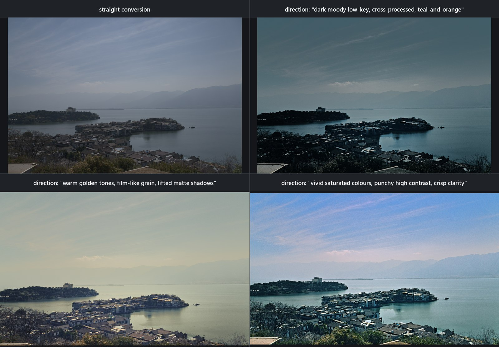

# AutoShade showcase

The four figures behind the README's pillars and the frames on
[autoshade.dev](https://autoshade.dev/#showcase-a), with every number the
captions quote and the prompts that bought the generated targets. Part A and
the Cornwall panel were rendered on 2026-09-02 on the v1.2.3 build; the
stone-viaduct panel's right column was re-rendered on 2026-09-03 on the v1.2.4
build at Reverse-fit strength 100 %, its other two columns being the v1.2.2
composition's frames re-encoded once; the desert-canyon panel was rendered
on 2026-09-12 on the v1.3.1 build; every frame not marked
*generated* is rendered by AutoShade's engine from a recipe, and every
"straight conversion" is AutoShade's own neutral develop of the RAW, not the
camera JPEG. Model-judge scores are automated review, not human aesthetic
approval. Image paths are relative to this file's directory.

Every RAW is a Sony α7R IVA 61 MP `.ARW` (9504 × 6336). The Cornwall frame was
shot with the body set to a 4:3 aspect, which is how it surfaced the frame
defect v1.2.2 fixes — one class, three places — on the way to this page (see
[RELEASE_NOTES_v1.2.2.md](RELEASE_NOTES_v1.2.2.md)).

## Part A — AI analysis with a style reference: one photograph, four looks

<b>Lakeside island town.</b> Top left, the straight conversion of a hazy
frame. The other three are AI develops of the same RAW at the same
<code>--style 1.0 --strength 0.9</code> against the same index — the
photographer's 169 Lightroom RAW+XMP edits (SigLIP 2 image vectors + Qwen3-VL
descriptions) beside the 94-photo finished-look library — and the only thing
that changes between them is the <b>direction text</b>. Since v1.2.3 a
written direction at the default Adherence leads: the four nearest past edits
reach the model as background continuity, the finished photo the direction
ranked highest reaches it as an image, and no pull toward the library's means
is applied. Measured on the panel's cells: mean saturation
28 % / 11 % / 30 % (moody / golden / vivid) against the conversion's
17 %, mean brightness 43 % / 58 % / 70 % against 47 %. The vivid develop's
recipe crops — its cell is 9504×5702, 7 % off the top and 3 % off the
bottom — while moody, golden and the conversion are the full 9504×6336
frame.
Direction and judge trail, per panel: <i>dark moody low-key tones, a
cross-processed colour treatment, a teal-and-orange split tone</i> — visual judge 68/100 Revise (the village and foreground shadows crushed, the orange counterpoint too weak), guided revisions re-scored 70 and 78 and were adopted, a third 69 was discarded, verdict Accept;
<i>warm golden tones, film-like grain, lifted matte shadows</i> — the verifier sent the proposal back twice because it never set the grain the direction asked for, the visual judge then scored 87 Revise (chroma noise across the smooth sky), its guided revision re-scored 84 and was discarded, and the verifier's word on the recipe was Revise, so this panel is the unsaved proposal rendered with <code>--out</code>;
<i>vivid saturated colours, punchy high contrast, crisp clarity</i> — visual judge 70/100 Revise (foliage and village crushed to near-black, dehaze and clarity halos), its guided revision re-scored 84 and was adopted, a second 82 was discarded, verdict Accept.
For contrast, the same three directions on the same index on v1.2.2 came back
at 23 % / 11 % / 17 % saturation and 54 % / 58 % / 55 % brightness — inside the
photographer's own cool, hazy register, four points of brightness apart —
because <code>--style 1.0</code> stated the four nearest edits' habits as the
target and the direction could only move within that anchor. Nothing is
copied pixel for pixel: the references reach the model as numbers, prose and
one image, the direction as text, and what comes back is a recipe the
engine renders.

<b>The same frame against the finished-look library alone</b> (2026-09-01,
the v1.2.2 showcase panel). With no RAW+XMP exemplars indexed — the state
v1.2.2's Defect 3 had left every index built on v1.2.0/v1.2.1 in — the Style
axis had nothing to act on and each run took one finished photo, chosen by
the direction text, as an image: mean saturation 34 % / 12 % / 29 % against
17 %, brightness 38 % / 61 % / 65 % against 47 %. Judge trails: moody 71 Revise
(guided revision 64 discarded), verdict Accept; golden 84 → 92 (adopted) after
the verifier twice sent the proposal back for the grain it never set, verdict
Revise (the unsaved proposal rendered with <code>--out</code>); vivid 64 → 72 →
84 (adopted) → 73 (discarded), verdict Accept. This is the ceiling on what a
direction can do with no library holding it back, and the v1.2.3 panel above
is measured against it.

## Part B — Reimagine → reverse-fit: the recipe carries the look, the RAW carries the detail

Part B is a different workflow: buy a complete visual target from a
generative model, then fit an ordinary engine recipe to its look. The
generated target can invent content; the fitted render cannot — it is the
original RAW through a recipe, so it has every pixel the sensor recorded. Each
panel's bottom row is the same small window of the frame from each stage at
its own native resolution: the straight conversion and the engine render are
1:1 crops of the 9504-px frame, the generated target is the same window of
its 3520-px frame, upsampled.

### Stone viaduct

<b>Stone viaduct.</b> Target bought from a configured
<code>gpt-image-2</code> at 3520 × 2352 with the prompt <i>"the same
photograph on a clearer afternoon: a little more contrast and a slightly
deeper blue sky, everything else unchanged"</i> — a grade, not a rebuild,
which is what keeps a generator on the input's structure: <code>reimagine</code>
measured <b>D = 0.177</b> against the frame it sent, and the calibration test
that pins this panel re-measures the two top-row frames at
<b>D = 0.180</b>, under the 0.35 threshold, so the full solve ran. The right
column is the v1.2.4 fit at Reverse-fit strength 100 % (the product default is
65 %). Look error <b>0.161 → 0.023</b>: a global tone and saturation solve
whose three cast curves were projected to t = 0.485 (as fitted they would
have opened a 22.1° hue fan in a class holding 0.210 of the frame's colour),
the per-band colour mixer at the 45 ceiling (Orange −32/+9, Yellow −45/0,
Aqua +45/−45, Blue +38/−45 saturation/luminance), a sky zone (−0.16 EV,
colour gains 0.91 / 1.00 / 1.05, saturation +8; zone residual 0.123 → 0.074)
and a land zone (0.00 EV, gains 1.01 / 1.00 / 1.00, saturation −4;
0.014 → 0.009), two boundary-gated spatial tiles (r3c3 and r3c2,
context-charged 0.0117 and 0.0120 against the 0.012 ceiling) and one field
mask (frame 0.0242 → 0.0234). Confidence 0.63, read from the two accepted
zones' worst residual, and the rationale still names what the fit never
solves (per-band hue, temperature and tint, local masks). At the default
65 % the same pair fits to 0.047 at confidence 0.25 with the mixer capped at
18 (Orange −18/+7, Yellow −18/−5, Aqua +18/−18, Blue +18/−18), a sky zone at
−0.15 EV, four tiles and two field masks; v1.2.2's default-strength fit of
it is where the seam fix was measured, on the top-left sky tile: its
cross-boundary step read 0.0278 → 0.0042 at k = 0.121 (context-charged
0.0116 against the 0.012 ceiling), and the delivered seam on the mask-free
ruler fell from +3.15 to +0.92 codes.

### Cornwall lighthouse islet

<b>Cornwall lighthouse islet.</b> Target bought from
<code>gpt-image-2</code> at 3520 × 2336 with the prompt <i>"the same
photograph with a slightly deeper blue sky and a little more contrast,
everything else unchanged"</i>. This body was set to a 4:3 aspect, so its
embedded preview is a centred 4:3 crop of the 3:2 sensor: the first purchase
sized the request from that preview, sent the develop squashed into 4:3 and
measured <b>D = 0.304</b>; sized from the sensor frame (v1.2.2) the same
prompt measured <b>D = 0.139</b>, and the panel's top-row frames re-measure
at <b>D = 0.136</b>. Look error <b>0.137 → 0.027</b> at
confidence 0.66, fitted on a neutral develop of the full frame
with the calibration composed into the solve — the route the desktop app
takes, which the CLI takes too whenever the preview is not the sensor
frame: a global tone and saturation solve with the per-band mixer on Aqua and Blue (−18 luminance each, Blue saturation −1), a sky zone (−0.10 EV, colour gains 1.00 / 1.00 / 1.00, saturation +6; zone residual 0.023 → 0.007) and a land zone (−0.20 EV, gains 1.03 / 1.00 / 0.97, saturation +5; 0.018 → 0.003), four boundary-gated spatial tiles (r0c3, r0c0, r2c2, r0c1, each context-charged 0.0112–0.0120 against the 0.012 ceiling) and two field masks (frame 0.0288 → 0.0270). This is the frame that found v1.2.3's cast defect. The
v1.2.2 fit admitted per-channel cast curves — red 0 → 23 and 255 → 179, green
0 → 56 and 255 → 189, blue 0 → 50 and 255 → 209 — which passed every hue veto
the stage had (foreign hue, a region re-hued ≥ 75°, the look-error ratio) and
still sorted the delivered sky 33.1° apart across luminance: violet in the
dark half, green-cyan in the bright cloud, while the sky's mean hue moved 0.7°.
A fourth veto now measures that fan on the rotation census's own population,
and a convicted cast is shrunk along one path — toward the shape the three
curves share, and beyond it toward no curves — to the strongest point whose
rendered candidate clears 7.5°: here t = 0.363, three identical curves, a
delivered sky spread of 9.6° against the target's 1.6° and v1.2.2's
33.1°. The global stage alone reads 0.137 → 0.030 at confidence
0.664 (v1.2.2 0.033 at 0.646 with the fanning curves; refused outright,
0.058 at 0.577). Both the gate and the projection are in
[RELEASE_NOTES_v1.2.3.md](RELEASE_NOTES_v1.2.3.md) with every number.

### Desert canyon at dusk

<b>Desert canyon at dusk.</b> The reference pair v1.3.0 and v1.3.1
were measured on, rendered on 2026-09-12 on the v1.3.1 build. The target
is a 3520 × 2336 <code>reimagine</code> purchase made from the desktop app
on 2026-09-10; the app records such a purchase as its origin file only,
not the Direction text or the model, so unlike the two panels above this
caption cannot quote the prompt. It is a full regeneration rather than a
grade: the sky's texture is re-synthesised and only its layout survives,
which is why this pair reads <b>D = 0.275</b> at pixel scale and 0.609 at
layout scale (the sky zone 0.617, the land 0.273) — under the 0.35 line at
frame scope, so the full solve ran, with the sky's pixels admitted on the
region's own 12 × 8 cell means where no pixel has a partner. The right
column is the v1.3.1 fit at Reverse-fit strength 85 % (`match --zoned`,
5 min 29 s; the product default is 65 %, where the colour field is inert by
design and the sky stays 27 ΔE from the target). Look error <b>0.110 →
0.048</b>: a solved white balance (5653 K as shot → 8400 K, tint +33),
exposure −1.3 EV with contrast +3.1 and blacks −3.4 under a six-knot
residual tone curve, global saturation +35, clarity and texture +20 within
the ±20 budget, the per-band mixer on Red and Orange (saturation +33,
luminance +33; Aqua and Blue one-sided, left neutral), no cast curves (they
would have re-hued a region), two Select Sky bands (band 1/2 at +0.14 EV,
saturation +6; band 2/2 at +0.19 EV, contrast +0.5, shadows −0.9,
saturation +3; accepted after 15 trials, analysis-scale ΔE 30.1 → 27.1),
four boundary-gated bitmap tiles (r2c2, r2c0, r1c0, r3c3; cross-boundary
steps 0.0023–0.0074 after shrink, each context-charged within the 0.012
ceiling), no field mask (both candidates refused by the zone gate), and the
12 × 8 × 8 colour field (frame residual 0.0439 → 0.0171, 85 of 88 measured
cells on the support-free solve). Confidence 0.25, read from the accepted
zone's residual (0.436), not the frame's 0.047. On the 2048 px acceptance
render: whole-frame mean |diff| against the target <b>0.0276</b> (v1.2.6
shipped 0.0571 from the command line and 0.0949 from the saved desktop
fit), sky ΔE <b>18.2 → 4.9</b> with |dL| 0.6 and L\*std 1.03 of the
target's, land ΔE 7.0 → 6.9. The far mesas keep a warm haze on the land
side that the render reads cooler (a\* 24.5 against 18): a haze-colour gap
along a real edge, inside the land's ΔE, disclosed as the known gap rather
than measured away. The full three-strength table is in
[RELEASE_NOTES_v1.3.0.md](RELEASE_NOTES_v1.3.0.md).

## Part C — The RAW denoiser: one star field, four ways

The operator's ISO-2500 star field, one 796 × 462 px window at 1:1, shown one
stop brighter than the develops (the same gain on all four panels). Top:
Lightroom's own develop with Denoise off and at 50 — the two exports the
star-frame standard reads. Bottom: AutoShade's neutral develop with no
denoise and with v2 of its own denoiser at the 71 % default — the two
product-path renders the standard read on the v1.6.0 build. The four files
share one frame; nothing is resampled.

What the standard measured on these files: 98.70 % of 17,817 true faint stars
kept against Lightroom's 98.80 %; the finished develop's fine-luminance ratio
0.2922 against Lightroom's 0.2701 (limit ±0.03) and its tile-to-tile width
0.0139 (limit 0.0278); bright-star peaks 0.939 of the input against
Lightroom's 0.953 and the four colour planes' flux spread 0.0385 against a
0.02 limit, the two lines that stay red. The denoiser's method, training and
acceptance lines are in [TECH_STACK.md#raw-denoise](TECH_STACK.md#raw-denoise);
the refused v3 and v4 in [RELEASE_NOTES_v1.6.0.md](RELEASE_NOTES_v1.6.0.md).

## What the figures do not show

Reverse-fit recovers global tone, saturation and guarded colour casts, and
bounded local corrections behind evidence and boundary gates. It does not
claim to recover generated objects or detail, per-band hue rotation, or a
target's local masks; every recipe's rationale names what the target appears
to use that the solve cannot reach. The style read carries a mood — with the
photographer's own edits indexed the advisor sees the four nearest as numbers
and prose, and in either case one finished photo as an image — not a
pixel-level look transfer, and a run that ends on a *Revise* verdict saves no recipe.
