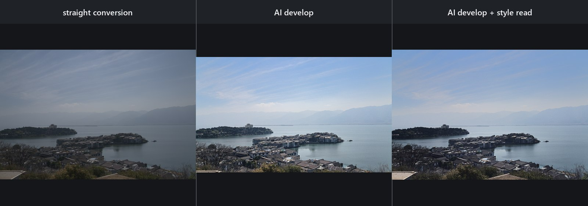
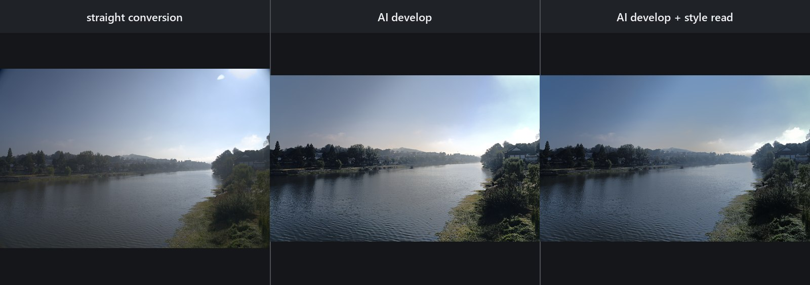
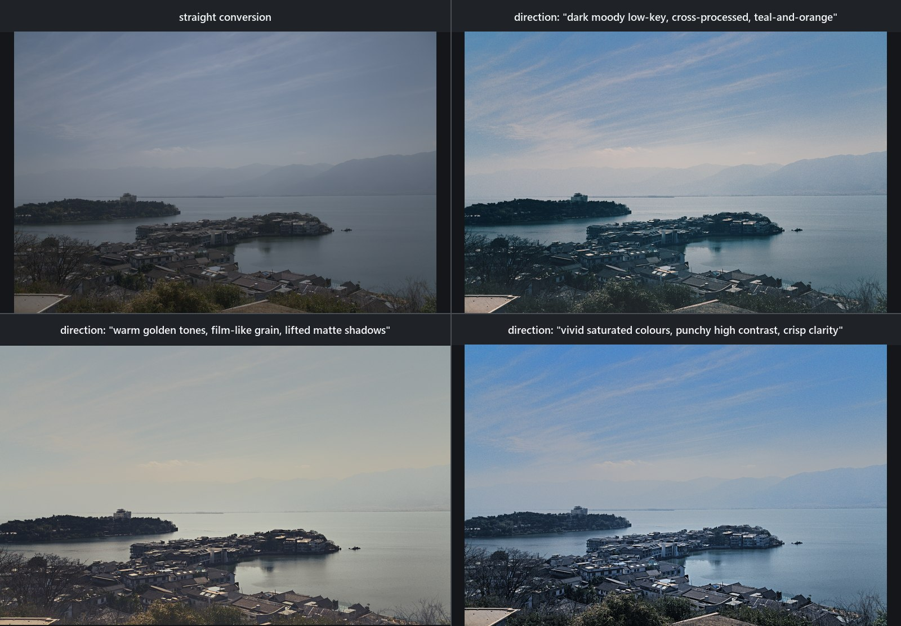
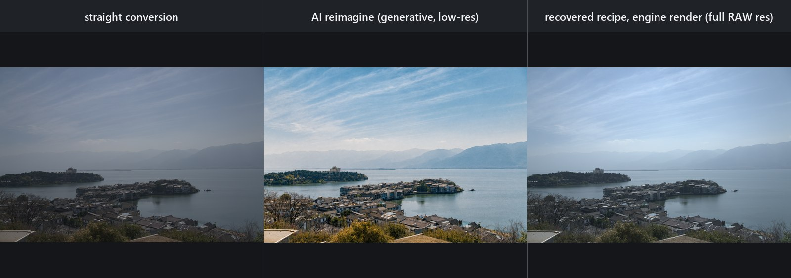

# Autoshop showcase

Further examples behind the frames in the
[README's results section](../README.md#results-two-batches-six-frames): the
current 2026-08-30 style-read and reimagine triptychs, the three established
`analyze` pairs — including two documented failure modes — and the earlier
batches, kept and labelled rather than quietly replaced. Image paths are
relative to this file's directory; every before is Autoshop's neutral
conversion of the same Sony α7R IVA `.ARW`.

Captions name the batch that produced them. Model-judge scores are automated
review, not human aesthetic approval, and a *Revise* verdict is reported as it
landed — a run that ends on Revise saves no recipe or XMP, and this page says
so instead of showing the frame without the verdict.

## Pairs that opened earlier README revisions

 
<b>AI analyze develop</b> (2026-08-30 batch). Sony α7R IVA <code>.ARW</code>, 61 MP: neutral engine conversion at left; at right the AI's develop at <code>--strength 0.9</code> with the style read disabled — its proposed crop (5607×3738 out of the sensor's 9504×6336), a global grade, and two local masks including a lift on the cat. The visual judge scored the first proposal 68/100, adopted two guided revisions at 78 and 84, discarded a third that came back at 78, and closed on <i>Accept</i>.

 
<b>Lake and boat, style read</b> (v0.35.0 batch). Left: neutral engine conversion. Right: the accepted develop that retrieved four similar edits from the indexed Lightroom library as soft references. Superseded on the README by the 2026-08-30 triptychs below; kept here as the earlier record.

 
<b>Stone viaduct, reimagine and reverse-fit</b> (v0.35.0 batch). Left: the 3520×2352 generated target. Right: the recovered recipe rendered on the original RAW at 9504×6336 (look error 0.057 → 0.019, confidence 0.678264). The same scene was re-run on 2026-08-30; those numbers are in Part B and are not the same fit.

## Showcase Part A — AI analysis and style transfer

### AI `analyze`: before and after

The shoreline pair on the project site's masthead is the first `analyze`
example: a Sony α7R IVA 61 MP `.ARW`, shown as straight conversion and AI
develop. The AI chose the crop, a committed global grade at `--strength 0.9`,
and two parametric masks including a lift on the cat.

The three established pairs below remain because they show different decisions
and, importantly, two current failure modes. Each before is Autoshop's neutral
conversion of the same Sony α7R IVA `.ARW`; each after is an AI-proposed engine
render, not a generated image. The faint watermark is identical on both halves
of these three older pairs.

#### Townhouse and pond: tonal range

<table>
<tr>
<td width="50%"> <b>Before:</b> neutral engine conversion.</td>
<td width="50%"> <b>After:</b> AI tone, white balance, crop, a linear sky hold, and a radial house lift.</td>
</tr>
</table>

The proposal protected white brick while opening the porch and black wall. Its
model judge moved from 84 to 86 after a bounded revision. Honest blemish: the
linear sky mask leaves a faint lighter band near the top-left corner. These are
model-judge scores recorded when the pair was produced (v0.33.0 showcase batch).

#### Balcony view: detail and texture

<table>
<tr>
<td width="50%"> <b>Before:</b> neutral engine conversion.</td>
<td width="50%"> <b>After:</b> AI texture, clarity, dehaze, tonal changes, and two linear masks.</td>
</tr>
</table>

The siding and shaded structure gain separation; the model judge moved from 78
to 84. These are model-judge scores recorded when the pair was produced
(v0.33.0 showcase batch). This pair is deliberately kept as a counter-example:
the sky is paler than the neutral base even though the local mask asks for more
sky depth.

#### Hillside neighborhood: establishing scene

<table>
<tr>
<td width="50%"> <b>Before:</b> neutral engine conversion.</td>
<td width="50%"> <b>After:</b> AI global contrast, restrained color, and green/aqua HSL reductions.</td>
</tr>
</table>

Automated visual model review rejected the first acidic-green proposal at 63
and retained a revision scored 87. These are model-judge scores recorded when
the pair was produced (v0.33.0 showcase batch). The landscape gains separation,
but the sky is again paler and milkier than the neutral conversion; that known
behavior is not captioned as an improvement.

### Style read: neutral, AI develop, and AI develop with references

These triptychs show three states of the same Sony α7R IVA 61 MP `.ARW`: straight
conversion, an AI develop with style influence disabled, and an AI develop that
read similar edits from the local style library. Both develops in the current
batch ran at `--strength 0.9`, so the only variable between the second and
third panel is whether the four retrieved neighbours reached the model. They
demonstrate the style retrieval path, not a pixel-copy or generative transfer.

<b>Lakeside island town</b> (2026-08-30 batch). Style off (center): judged 80/100, one guided revision adopted at 84, a second discarded at 83, verdict <i>Accept</i>. Style on (right): judged 84, two revisions adopted at 84 and 91, and the run still closed on <i>Revise</i> because the judge's bar was never cleared — so no style-read recipe/XMP was saved and the panel is a transparent comparison only.

<b>River bend</b> (2026-08-30 batch). Style off: 63 → 69 adopted, a second revision discarded at 68, verdict <i>Accept</i>. Style on: 68 → 72 → 78 adopted, a third discarded at 72, and still <i>Revise</i>. The style read carried this frame further in every round and still did not satisfy the judge.

<b>One photograph, three looks</b> (2026-08-31 batch, post text-hubness correction). The same frame, the same <code>--style 1.0 --strength 0.9</code>, the same 169-exemplar library — only the direction text changes. Each run retrieved a <i>different</i> finished look from the 94-photo look library (tags: <i>dark moody low-key / muted desaturated / cross-processed</i>; <i>cinematic, warm golden tones, soft low contrast</i>; <i>cool blue tones, punchy high contrast, cross-processed</i>) and the three grades measurably diverge (mean saturation 63 / 18 / 75 against the conversion's 45). Judged 92; 86 with one guided revision adopted at 91; 84 with its revision re-scored 73 and discarded (do-no-harm). All three closed on <i>Revise</i> against the direct-tier target, so none auto-saved.

#### Earlier style-read batch (v0.35.0)

Kept as the record of what this page showed before 2026-08-30. Both ran at the
shipped conservative defaults (`--strength 0.65`, `--style 0.5`), which is why
their panels separate less than the two above.

<b>Lake and boat</b> (v0.35.0 batch). The style-read run referenced four similar edits from the indexed Lightroom library and was accepted. The style-off middle panel rendered under a Revise verdict and therefore has no saved recipe/XMP; it is retained only as a transparent comparison.

<b>Sunset</b> (v0.35.0 batch). The middle panel is an accepted style-off develop. The style-read proposal at right used retrieved references and rendered at full RAW resolution, but the model judge marked it Revise (85); its attempted revision scored 84 and was discarded, so no style-read recipe/XMP was saved.

## Showcase Part B — full-image generation to recipe inversion

Part B is a different workflow: generate a complete visual target, then fit an
ordinary engine recipe to its look. The generated target can invent content;
the fitted render cannot. The recovered recipe is editable and can be applied
deterministically to the original full-resolution RAW.

### Island town: divergence fires, and the fit says so

<b>Lakeside island town, Sony α7R IVA 61 MP <code>.ARW</code></b> (2026-08-30 batch). Left: neutral engine conversion of a hazy frame. Center: a 3520×2352 target generated with a configured <code>gpt-image-2</code>, asked for the same scene on a clear day — it invented its way through the haze. Right: the recovered recipe rendered on the original RAW at 9504×6336. <code>reimagine</code> measured structural divergence <b>D = 0.732</b> against the frame it sent and the fit re-measured <b>D = 0.731</b> against the neutral render, so the fit refused the full solve and ran the bounded <b>Atmosphere</b> mode: exposure within ±1 EV, white-balance gains in [0.80, 1.25], saturation within ±30, no per-channel curves, confidence capped at 0.50. Look error 0.207 → 0.093 at confidence 0.440221, and not one local zone survived its own quality gate — the recovered recipe carries zero masks. The per-band colour mixer proposed a move and gave it back: Orange and Yellow are one-sided on this pair (the generation replaced their population), and the fit treats unmeasurable as unmeasurable, never as equal. Visibly better than the original and visibly short of the generated frame: the haze is <i>in</i> the photograph, and no develop control recovers what was never recorded.

### Viaduct reimagine and reverse-fit

<table>
<tr>
<td width="33%"> <b>Original.</b> Neutral engine conversion of the RAW.</td>
<td width="33%"> <b>Generated.</b> A 3520×2352 target from a configured <code>gpt-image-2</code>.</td>
<td width="33%"> <b>Reverse-fit.</b> The recovered recipe on the original RAW at 9504×6336.</td>
</tr>
</table>

<b>Stone viaduct, Sony α7R IVA 61 MP <code>.ARW</code></b> (2026-08-30 batch). The same three stages on a frame the generator stayed close to: <b>D = 0.126</b>, under the 0.35 threshold, so the full solve ran. Look error 0.048 → 0.015 at fit confidence 0.662411 — the global stage reached 0.019, with the per-band colour mixer solving three bands from their own populations (Orange sat −18, Yellow sat −18 lum −18, Blue sat +18); four frozen-evidence spatial tiles (<code>r0c1</code>, <code>r0c3</code>, <code>r1c3</code>, <code>r3c0</code>) and one evidence-derived field mask bought the rest.

**Honest blemish, and an open defect.** The top-right tile leaves a visible
rectangular seam in the sky of the third pane — a vertical step about three
quarters of the way across, running down from the top edge. Its boundary-continuity gate reported `signed rim
0.000 -> 0.000 after direction-preserving shrink k=1.000 (budget 0.012, 0
measured transitions)` and passed it — a pass with nothing measured behind it.
A spatial tile's frozen evidence is scoped by a hard rectangular predicate, so
its weights are 255 or 0 with no transition band, and the rim reading only
samples weights strictly between 0.05 and 0.95. On the same frame the semantic
zone gate read `candidate rim 0.312 ... 492 measured transitions` and correctly
refused. The tile rim gate is therefore vacuous as written; it is filed as a
v1.1 obligation rather than captioned as a success.

#### Earlier reimagine batch (v0.35.0)

<b>Sunset, Sony α7R IVA 61 MP <code>.ARW</code></b> (v0.35.0 batch). Left: neutral engine conversion. Center: a 3520×2352 full-image target generated with a configured <code>gpt-image-2</code>. Right: the recovered recipe rendered by Autoshop on the original RAW at 9504×6336. The statistical look error moved from 0.060 to 0.042 at fit confidence 0.746691; this is a deterministic tonal/color approximation, not a pixel-aligned reconstruction of generated detail.

Reverse-fit measures structural divergence first: same-content targets keep the
full tone, saturation, and guarded-cast solve, while structurally changed
targets use bounded Atmosphere mode for overall tone and colour. Zoned fits
retain independently bounded sky/land adjustments behind a local-quality gate;
they do not claim to reconstruct generated objects or detail.
Atmosphere controls read population facts on one structure-blind report ruler,
while Full zones and detail retain the separate structural evidence and the
recipe rationale discloses that split.
