# Autoshop showcase

Further examples behind the three pairs in the
[README's results section](../README.md#results-two-batches-six-frames): the
three established `analyze` pairs — including two documented failure modes
— the style-read triptychs, and both reimagine/reverse-fit triptychs. Image
paths are relative to this file's directory; every before is Autoshop's
neutral conversion of the same Sony α7R IVA `.ARW`.

## Pairs that opened earlier README revisions

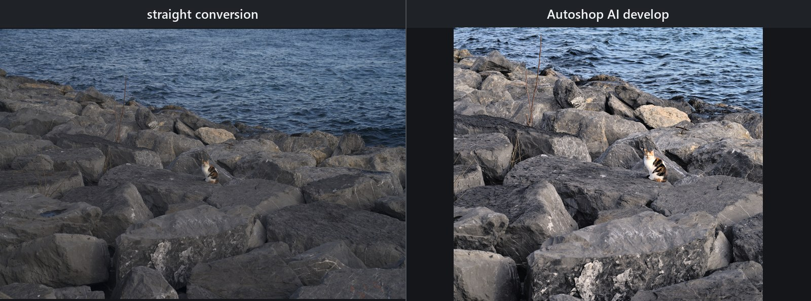
 
<b>AI analyze develop.</b> Sony α7R IVA <code>.ARW</code>, 61 MP: neutral engine conversion at left; AI-proposed crop, global tone, a radial cat lift, and a linear water hold at right. The model judge moved from 62 to 86; that score is automated review, not human aesthetic approval.

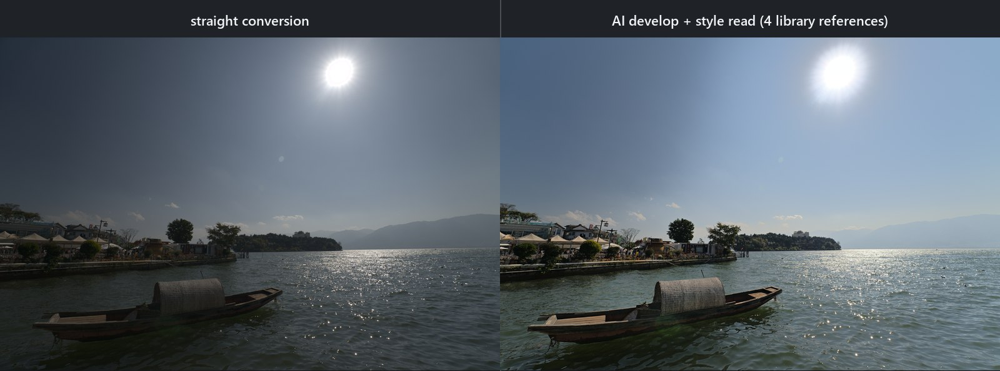
 
<b>Lake and boat, style read.</b> Left: neutral engine conversion. Right: the accepted develop that retrieved four similar edits from the indexed Lightroom library as soft references.

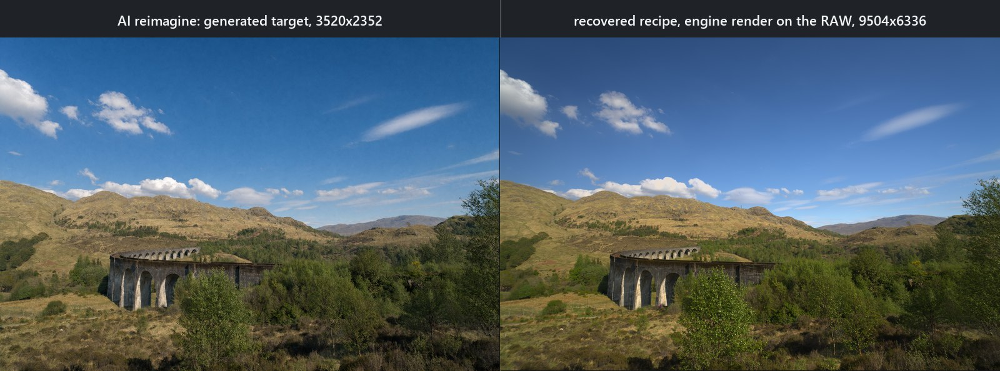
 
<b>Stone viaduct, reimagine and reverse-fit.</b> Left: the 3520×2352 generated target. Right: the recovered recipe rendered on the original RAW at 9504×6336 (look error 0.057 → 0.019, confidence 0.678264).

## Showcase Part A — AI analysis and style transfer

### AI `analyze`: before and after

The cat pair in the README's results section is the first `analyze` example: a Sony α7R IVA 61 MP `.ARW`,
shown as straight conversion and AI develop. The AI chose the crop and a
restrained global develop plus radial and linear parametric masks; it did not
use an AI bitmap segmentation mask.

The three established pairs below remain because they show different decisions
and, importantly, two current failure modes. Each before is Autoshop's neutral
conversion of the same Sony α7R IVA `.ARW`; each after is an AI-proposed engine
render, not a generated image. The faint watermark is identical on both halves
of these three older pairs.

#### Townhouse and pond: tonal range

<table>
<tr>
<td width="50%">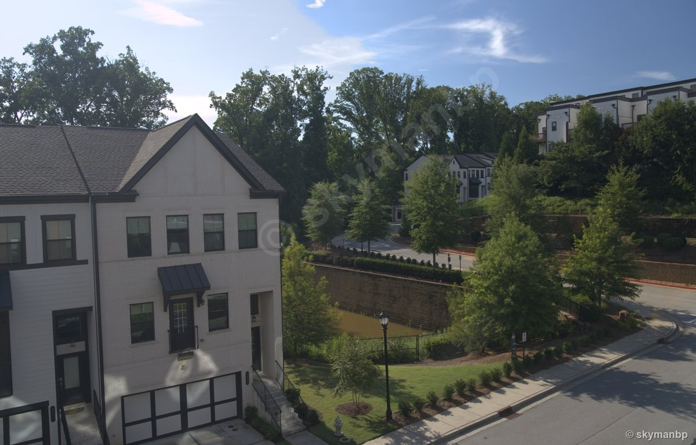 <b>Before:</b> neutral engine conversion.</td>
<td width="50%">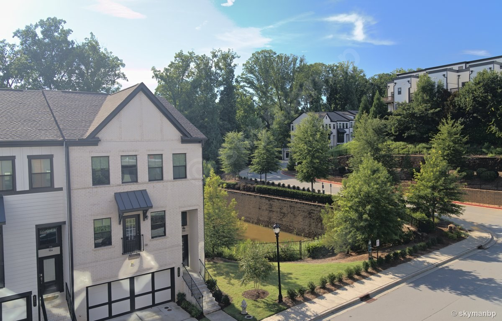 <b>After:</b> AI tone, white balance, crop, a linear sky hold, and a radial house lift.</td>
</tr>
</table>

The proposal protected white brick while opening the porch and black wall. Its
model judge moved from 84 to 86 after a bounded revision. Honest blemish: the
linear sky mask leaves a faint lighter band near the top-left corner. These are
model-judge scores recorded when the pair was produced (v0.33.0 showcase batch).

#### Balcony view: detail and texture

<table>
<tr>
<td width="50%">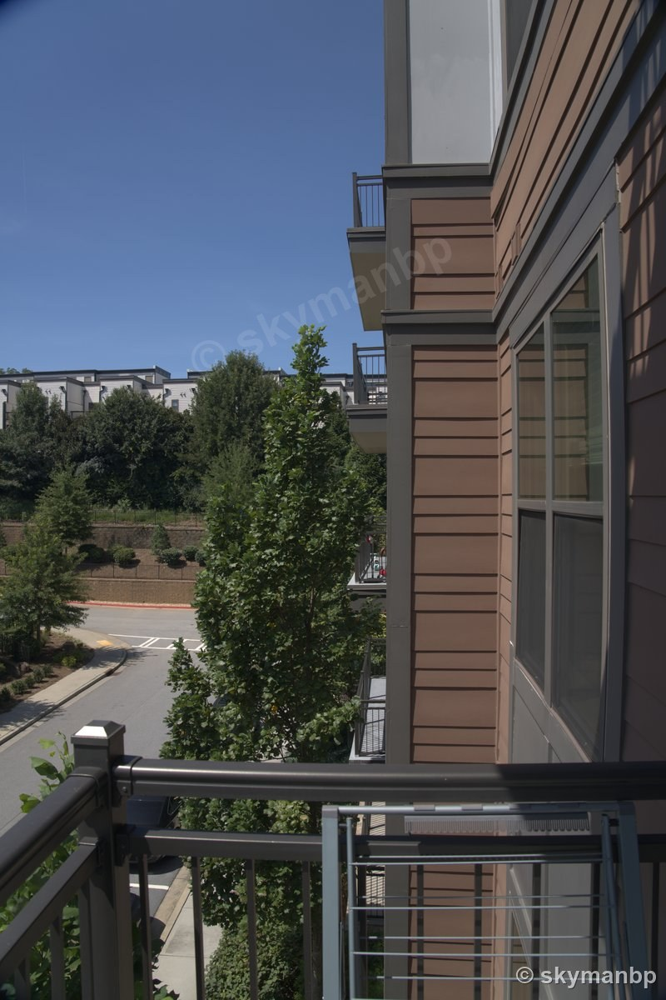 <b>Before:</b> neutral engine conversion.</td>
<td width="50%">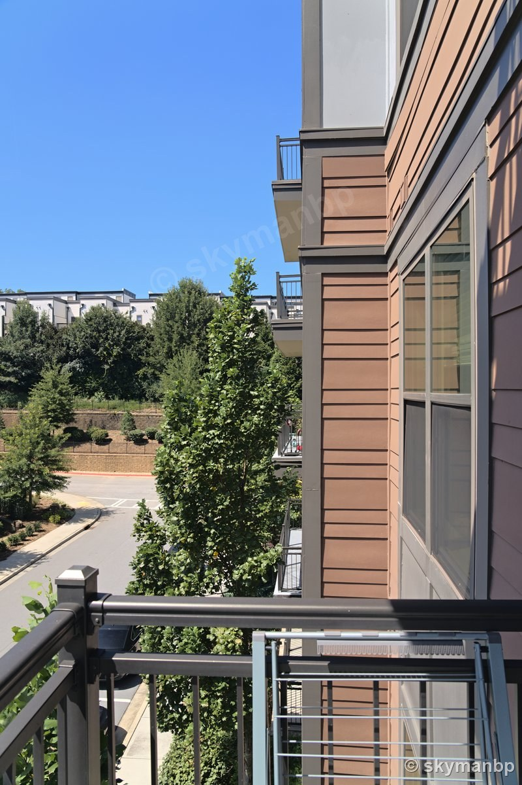 <b>After:</b> AI texture, clarity, dehaze, tonal changes, and two linear masks.</td>
</tr>
</table>

The siding and shaded structure gain separation; the model judge moved from 78
to 84. These are model-judge scores recorded when the pair was produced
(v0.33.0 showcase batch). This pair is deliberately kept as a counter-example:
the sky is paler than the neutral base even though the local mask asks for more
sky depth.

#### Hillside neighborhood: establishing scene

<table>
<tr>
<td width="50%">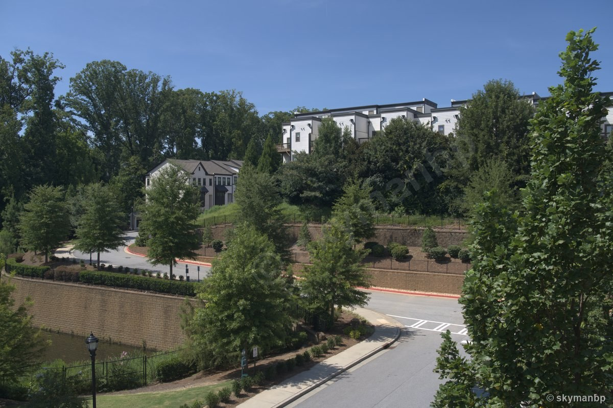 <b>Before:</b> neutral engine conversion.</td>
<td width="50%">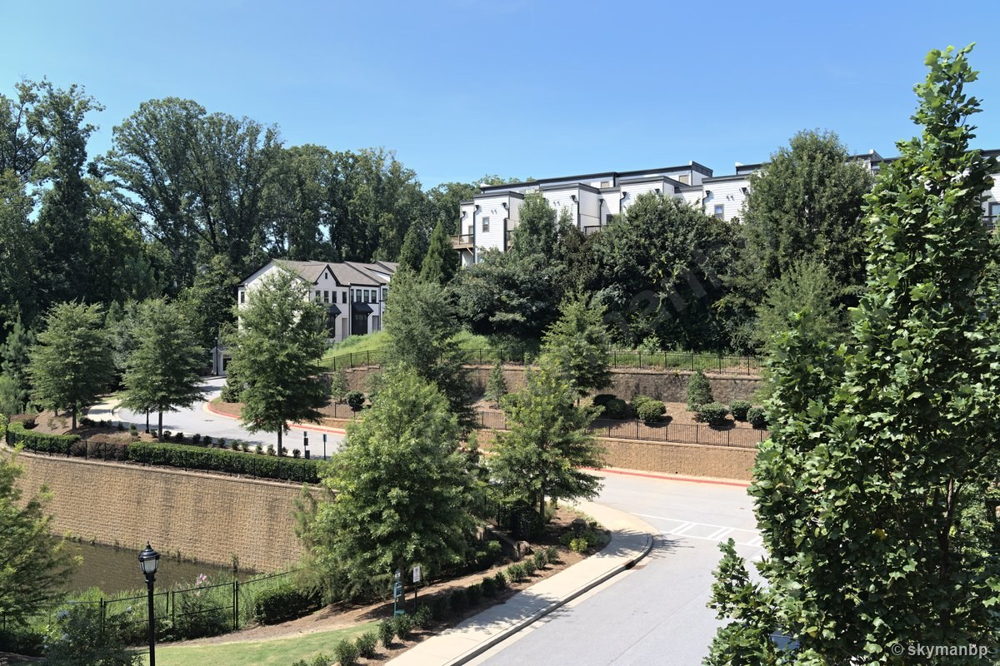 <b>After:</b> AI global contrast, restrained color, and green/aqua HSL reductions.</td>
</tr>
</table>

Automated visual model review rejected the first acidic-green proposal at 63
and retained a revision scored 87. These are model-judge scores recorded when
the pair was produced (v0.33.0 showcase batch). The landscape gains separation,
but the sky is again paler and milkier than the neutral conversion; that known
behavior is not captioned as an improvement.

### Style read: neutral, AI develop, and AI develop with references

These triptychs show three states of the same Sony α7R IVA 61 MP `.ARW`: straight
conversion, an AI develop with style influence disabled, and an AI develop that
read similar edits from the local style library. They demonstrate the style
retrieval path, not a pixel-copy or generative transfer.

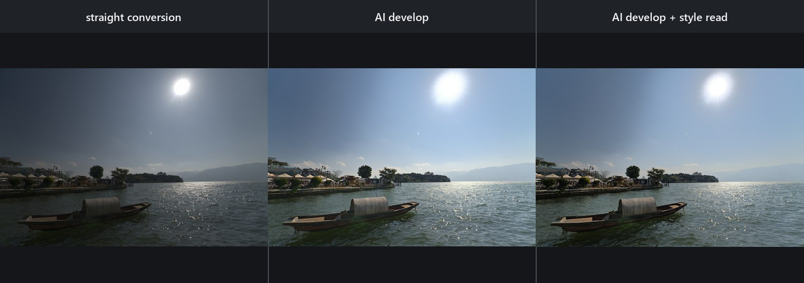

<b>Lake and boat.</b> The style-read run referenced four similar edits from the indexed Lightroom library and was accepted. The style-off middle panel rendered under a Revise verdict and therefore has no saved recipe/XMP; it is retained only as a transparent comparison.

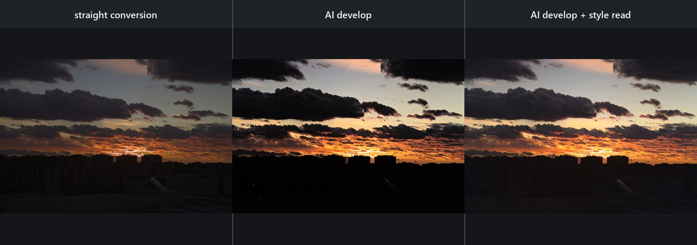

<b>Sunset.</b> The middle panel is an accepted style-off develop. The style-read proposal at right used retrieved references and rendered at full RAW resolution, but the model judge marked it Revise (85); its attempted revision scored 84 and was discarded, so no style-read recipe/XMP was saved.

## Showcase Part B — full-image generation to recipe inversion

Part B is a different workflow: generate a complete visual target, then fit an
ordinary engine recipe to its look. The generated target can invent content;
the fitted render cannot. The recovered recipe is editable and can be applied
deterministically to the original full-resolution RAW.

### Sunset reimagine and reverse-fit

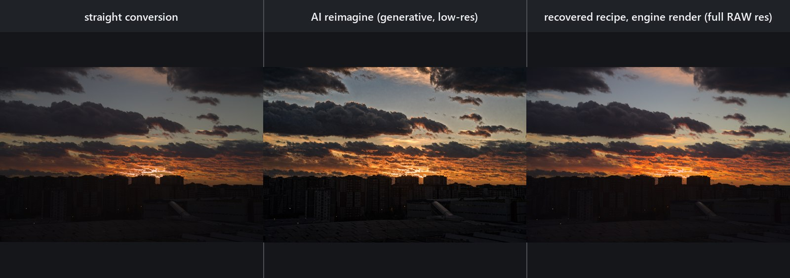

<b>Sunset, Sony α7R IVA 61 MP <code>.ARW</code>.</b> Left: neutral engine conversion. Center: a 3520×2352 full-image target generated with a configured <code>gpt-image-2</code>. Right: the recovered recipe rendered by Autoshop on the original RAW at 9504×6336. The statistical look error moved from 0.060 to 0.042 at fit confidence 0.746691; this is a deterministic tonal/color approximation, not a pixel-aligned reconstruction of generated detail.

### Viaduct reimagine and reverse-fit

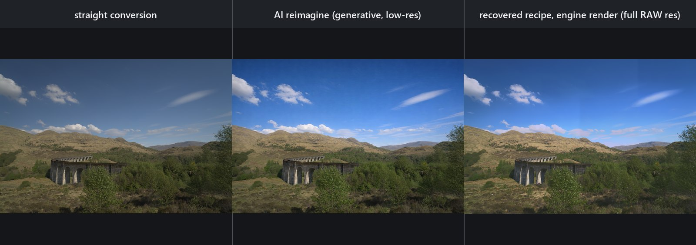

<b>Stone viaduct, Sony α7R IVA 61 MP <code>.ARW</code>.</b> Left: neutral engine conversion. Center: a 3520×2352 full-image target generated with the same configured <code>gpt-image-2</code>. Right: the recovered recipe rendered on the original RAW at 9504×6336. The statistical look error moved from 0.057 to 0.019 at fit confidence 0.678264; the fitted color-cast stage was rejected by the fit's own do-no-harm review, so the recovered recipe carries tone and saturation only.

Reverse-fit measures structural divergence first: same-content targets keep the
full tone, saturation, and guarded-cast solve, while structurally changed
targets use bounded Atmosphere mode for overall tone and colour. Zoned fits
retain independently bounded sky/land adjustments behind a local-quality gate;
they do not claim to reconstruct generated objects or detail.
Atmosphere controls read population facts on one structure-blind report ruler,
while Full zones and detail retain the separate structural evidence and the
recipe rationale discloses that split.
